# The Open-Weight Agent Stack: A Performance-First Build Manual

The complete blueprint for building agentic AI on open-weight models: choosing hardware and serving
it fast, grounding answers in your own data, guarding every input, and operating the loop in
production. Hardware is assumed rather than minimised; **latency and throughput** are the ruling
metrics, because an agent loop multiplies every millisecond, a turn that makes eight model calls
pays each cost eight times.

**A note on names.** "Open-weight" and "open-source" are not interchangeable, and licences vary
*within* a family far more than the family name suggests. Llama is licensed per generation, none of
them OSI-approved. Gemma 4's core series is Apache-2.0 while Gemma 3 and earlier, and the sibling
variants, keep custom terms. Qwen 2 and 2.5 are generally Apache-2.0, but some sizes and older
generations use Qwen-specific terms. Mistral ships four different licences at once, and its flagship is the permissive one.
MiniMax M2.7 requires prior written authorisation for commercial use. The named DeepSeek V4 Pro / V4
Flash and GLM-5.2 / GLM-4.5-Air checkpoints are MIT; Kimi K3 has its own licence.
Never infer a licence from a family name: check the model card, and see
[docs/MODELS.md](docs/MODELS.md) for the per-model breakdown. The Sources and verification section at the end of this manual records primary sources for a tracked set of volatile claims.

## 1. How to read this manual

The manual is organised as five concentric rings, innermost first, a **prompt** sits inside a
**context**, runs in a **harness**, is judged by **evals**, and is driven by a **loop**. Each ring
wraps the one before it, and a failure in an inner ring cannot be repaired by an outer one:

| Ring | What it governs | Sections |
|---|---|---|
| Prompt | one model turn: contract, schema, refusal path | 10 |
| Context | what enters the window, and its provenance | 8, 12, 15, 16 |
| Harness | tools, sandboxing, credentials, trust boundaries | 5, 6, 11, 14, 18, 19 |
| Eval | how "good" becomes a reproducible verdict | 13 |
| Loop | scheduling, bounded rework, termination | 7, 9, 17, 20, 25 |

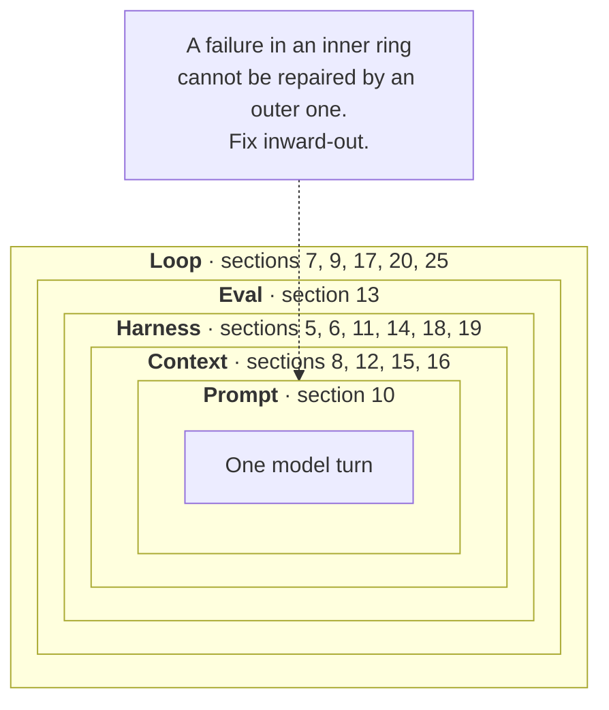
```mermaid
flowchart TB
    subgraph LOOP["<b>Loop</b> · sections 7, 9, 17, 20, 25"]
        direction TB
        subgraph EVAL["<b>Eval</b> · section 13"]
            direction TB
            subgraph HARN["<b>Harness</b> · sections 5, 6, 11, 14, 18, 19"]
                direction TB
                subgraph CTX["<b>Context</b> · sections 8, 12, 15, 16"]
                    direction TB
                    subgraph PROM["<b>Prompt</b> · section 10"]
                        direction TB
                        CORE["One model turn"]
                    end
                end
            end
        end
    end

    NOTE["A failure in an inner ring<br/>cannot be repaired by an outer one.<br/>Fix inward-out."]
    NOTE -.-> PROM
```

Read the nesting as containment, not as a call sequence. A retrieval bug is a Context failure, and no
amount of loop scheduling or eval rigour outside it will repair the answer; that is what the innermost
arrow is warning about.

**Identity is a first-class layer.** The retrieval filter, the cache key and the tool allow-list all
enforce an entitlement scope; section 18 is what issues it, and section 19 maps the whole design
against the OWASP Top 10 for Agentic Applications.

**Deciding what your own machine can run? Start with "Start here" below**: Mac, NVIDIA, AMD, Intel,
Windows and CPU-only each get a row. Section 22 maps task shape to model, section 23 covers the SDK
and platform choice, and section 24 is the full code-agent landscape. Section 21 catalogues every
swap option per layer.

**How claims are marked.** Trust in a manual like this rests on knowing which numbers were measured
and which are field judgement, so three levels are used consistently:

| Marker | What it means |
|---|---|
| A plain number | Sourced or derivable. Section 27 links the primary source, or the arithmetic is shown |
| `reported` | A figure attributed to whoever measured it. Repeated here, not reproduced here |
| `indicative` | An engineering heuristic with no published source. A planning starting point, not a measurement |

A claim carrying none of the three is a defect worth reporting. What the automated checks do and do
not prove is set out in [docs/VERIFICATION.md](docs/VERIFICATION.md).

Every diagram in this manual is standard Mermaid. Use GitHub's renderer or another compatible Mermaid viewer; rendering details can vary by viewer version.

## 2. What can you actually run?

Everything after this section is the same architecture regardless of your hardware. What *changes* with hardware is which models you can serve locally, which runtime you use, and where the ceiling sits. Find your row, then read the rest normally.

**A first sizing pass:** at 4-bit, weights are often about **parameters × 0.5-0.6 GB**, where the quant format decides the exact point in that band. The 7B, 32B, and 70B examples below are illustrative estimates, not capacity guarantees: a 7B can land near 4 GB, a 32B near 16-18 GB, and a 70B near 35-40 GB before runtime overhead. KV-cache memory is roughly `batch × context × layers × 2 × KV heads × head dimension × bytes per element`; it depends on architecture, KV-head count, precision, batch, and context length, so measure the exact serving configuration before buying hardware.

The quant format also decides which runtime can load the file, and the pairings are fixed, 
download the artefact that matches your stack instead of converting after the fact:

| Format | Loads in | Notes |
|---|---|---|
| GGUF | llama.cpp · Ollama · LM Studio · Jan | The CPU, Metal, and Vulkan family; one file format across every platform |
| AWQ / GPTQ | vLLM · SGLang · TensorRT-LLM | GPU-server formats; quality and throughput depend on the model, calibration, and serving runtime, so validate both on your eval set |
| FP8 | vLLM · SGLang · TensorRT-LLM (Ada, Hopper, or newer) | Often a useful accuracy/throughput trade-off on supported hardware; validate model-specific quality and memory use. FP4 arrives with Blackwell-class GPUs; NVIDIA publishes ready NVFP4 checkpoints of open flagships |
| MLX | MLX · LM Studio on Apple Silicon | Pre-converted checkpoints live on Hugging Face under mlx-community |

| Your setup | Runtime to use | Realistic ceiling | Notes |
|---|---|---|---|
| **Mac, 16 GB** | MLX, or Ollama / LM Studio | 7-8B at 4-bit | Comfortable for a fast tier and structured output |
| **Mac, 32 GB** | MLX | 14-32B at 4-bit | The sweet spot for local development |
| **Mac, 64 GB+** | MLX | 70B at 4-bit | Unified memory runs models a discrete GPU of the same price cannot |
| **NVIDIA 8-12 GB** | Ollama · llama.cpp (CUDA) | 7-8B at 4-bit | 3060/4060 class |
| **NVIDIA 16-24 GB** | vLLM · SGLang | 14-32B at 4-bit | 3090/4080/4090 class; real batching starts here |
| **NVIDIA 48 GB+** | SGLang · vLLM · TensorRT-LLM | 70B at 4-bit | A6000 / L40S / H100 |
| **Multi-GPU node** | SGLang · vLLM · TensorRT-LLM | 70-120B, tensor parallel | NVLink matters more than raw count |
| **AMD on Linux** | ROCm + llama.cpp or vLLM | By VRAM, as NVIDIA | ROCm support is good on Linux |
| **AMD on Windows** | **llama.cpp with Vulkan** | By VRAM | **ROCm on Windows covers only select new hardware** (Radeon AI PRO R9000, Ryzen AI Max PRO 400). Vulkan ships with every AMD driver, no CUDA emulation needed |
| **Intel Arc / Core Ultra** | IPEX-LLM · OpenVINO · Vulkan | 7-14B at 4-bit | Improving quickly; verify your model is supported |
| **Windows, any GPU** | LM Studio / Ollama native, or **WSL2** for the Linux stack | As per GPU row | WSL2 is how you get vLLM/SGLang on Windows |
| **CPU only** | llama.cpp | 3-8B, indicative 3-7 tok/s | 7B Q4, batch 1, recent desktop CPU under llama.cpp. CPU-only chat is possible for small models, but typically slow and limited to low-concurrency use; benchmark your processor and context length |
| **NVIDIA DGX Spark** | SGLang · vLLM · Ollama | 70B-class at 4-bit | GB10, 128 GB unified memory; the desktop supercomputer tier |
| **NVIDIA Jetson (edge)** | llama.cpp · TensorRT-LLM | 3-13B on-device | Orin and Thor modules; agents at the edge, no rack required |
| **Cloud accelerators** | Managed runtimes | By instance | TPU on GCP, Trainium and Inferentia on AWS, ND GPUs on Azure; see section 23.5 |
| **Rented GPU** | Same as NVIDIA rows | Whatever you pay for | RunPod · Modal · Lambda · vast.ai, hourly, no capex |
| **No local hardware** | API only | Frontier | Skip the serving layer entirely; sections 5 to 21 still apply |

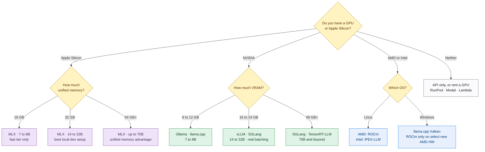
```mermaid
flowchart TB
    Q0{"Do you have a GPU<br/>or Apple Silicon?"}
    Q0 -->|"Apple Silicon"| MAC{"How much<br/>unified memory?"}
    Q0 -->|"NVIDIA"| NV{"How much VRAM?"}
    Q0 -->|"AMD or Intel"| OTHER{"Which OS?"}
    Q0 -->|"Neither"| NONE["API only, or rent a GPU<br/>RunPod · Modal · Lambda"]

    MAC -->|"16 GB"| M1["MLX · 7 to 8B<br/>fast tier only"]
    MAC -->|"32 GB"| M2["MLX · 14 to 32B<br/>best local dev setup"]
    MAC -->|"64 GB+"| M3["MLX · up to 70B<br/>unified memory advantage"]

    NV -->|"8 to 12 GB"| N1["Ollama · llama.cpp<br/>7 to 8B"]
    NV -->|"16 to 24 GB"| N2["vLLM · SGLang<br/>14 to 32B · real batching"]
    NV -->|"48 GB+"| N3["SGLang · TensorRT-LLM<br/>70B and beyond"]

    OTHER -->|"Linux"| O1["AMD: ROCm<br/>Intel: IPEX-LLM"]
    OTHER -->|"Windows"| O2["llama.cpp Vulkan<br/>ROCm only on select new AMD HW"]

    classDef q fill:#fff3c2,stroke:#997404,color:#5c2e00
    classDef mac fill:#efe3f9,stroke:#8944ab,color:#3f2c52
    classDef nv fill:#dff3e6,stroke:#248a3d,color:#0f3d23
    classDef other fill:#e8f0fe,stroke:#0071e3,color:#003a70
    classDef none fill:#fbfbfd,stroke:#6e6e73,color:#1d1d1f

    class Q0,MAC,NV,OTHER q
    class M1,M2,M3 mac
    class N1,N2,N3 nv
    class O1,O2 other
    class NONE none
```

**Mac versus NVIDIA, honestly.** Apple Silicon's unified memory means a 64 GB Mac can hold a 70B model that a 24 GB discrete GPU simply cannot, no offloading, no 2 tok/s crawl. NVIDIA wins decisively on *throughput*: continuous batching, tensor parallelism, and serving many users at once. Mac for development and single-user work; NVIDIA for anything serving a team.

**On Apple Silicon, prefer MLX.** It was built for the unified-memory architecture and runs faster than llama.cpp, published comparisons range from ~20% to ~87%, on models under 14B. The advantage narrows on larger models, where memory bandwidth dominates, and at contexts beyond ~40K. Recent Ollama builds use MLX underneath on M-series, so you may already be getting it.

**Windows is not a second-class citizen, but it is a fork in the road.** Native LM Studio or Ollama is the easy path. WSL2 is how you run the full Linux serving stack (vLLM, SGLang) with CUDA passthrough. On AMD, Windows usually means Vulkan, native ROCm exists only for select new hardware (Radeon AI PRO R9000 and Ryzen AI Max PRO 400 series, per AMD's compatibility matrix).

---

## 3. The thirteen-layer stack

Thirteen layers, identity through deployment. Each layer lists several real options: pick by what
you already run, not by what leads a benchmark this month. The ring column ties each layer back to
section 1, and the numbered sections that follow open each layer up.

| # | Layer | Job | Ring | Options |
|---|---|---|---|---|
| 0 | Identity and access | Who is acting, on whose behalf | Harness | OIDC/OAuth2 · Keycloak · Auth0 · SPIFFE · OPA/Cedar |
| 1 | Clients | Entry points | Harness | Web · mobile/PWA · CLI · Slack/Teams · cron/webhooks · API |
| 2 | Frontend and edge | Capture and stream | Harness | Next.js · SvelteKit · Streamlit · Gradio · Chainlit · Open WebUI |
| 3 | Orchestrator | Plans and routes | Loop | LangGraph · CrewAI · LlamaIndex Workflows · Pydantic AI · AutoGen · plain tool loop |
| 4 | Knowledge decision | Retrieve or answer directly | Context | Router model · classifier · heuristic rules · always-retrieve |
| 5 | RAG pipeline | Grounding | Context | Docling · Unstructured · BGE-M3 · Qwen3-Embedding · Qdrant · pgvector · Chroma · reranker |
| 6 | Model layer | Serving runtime and models | Prompt | SGLang · vLLM · TensorRT-LLM · Ollama · llama.cpp · MLX · LM Studio · any API |
| 7 | Tools via MCP | External systems | Harness | MCP servers · OpenAPI specs · GitHub · Slack · Jira · databases · filesystem · web search |
| 8 | Code agent | Writes and tests code | Harness | Cline · Kilo Code · OpenHands · Goose · Cursor · Claude Code · Zed |
| 9 | Memory and cache | State and speed | Context | LangGraph store · Redis/Valkey · Hermes Agent · Claude-Mem · MemPalace · GBrain · MemSearch · Mem0 · Postgres/Supabase/SQLite · DuckDB |
| 10 | Guardrails and evals | Quality and safety | Eval | Outlines · Guardrails AI · NeMo Guardrails · Llama Guard · Ragas · Promptfoo · DeepEval |
| 11 | Observability | Trace and measure | Eval | Langfuse · Phoenix · OpenTelemetry · Grafana + Loki · Helicone |
| 12 | Deployment | Wherever you can run it | Loop | Mac/MLX · single GPU · multi-GPU node · CPU only · WSL2 · Docker · Kubernetes · rented GPU · API only |

Each layer has a deeper companion file in the GitHub repository, with decision guidance and a link
for every tool named: [github.com/mlvpatel/open-weight-agent-stack](https://github.com/mlvpatel/open-weight-agent-stack/tree/main/docs/layers).
Suggestions and corrections are welcome there; the bar for a change is a primary source.

---

## 4. The design method: HLD, LLD and the rules

This manual doubles as a worked example of design discipline. **High-level design (HLD)** fixes
components, responsibilities, data flows and trust boundaries, enough to review scope, cost and
risk before anyone writes code. **Low-level design (LLD)** fixes contracts precise enough to
implement against: schemas, sequences, state machines, token formats. Every figure here is one or
the other on purpose:

| Artifact type | Level | It answers | In this manual |
|---|---|---|---|
| Component / context diagram | HLD | What exists, what talks to what | 5 |
| Deployment topology | HLD | Where it runs, what scales | 14, 23 |
| Trust-boundary diagram | HLD | What is untrusted, where the checks live | 11 |
| Threat model / control matrix | HLD | What can go wrong, which control answers it | 19 |
| Sequence diagram | LLD | The exact order of one interaction | 6 |
| State machine | LLD | Every state and transition, exits included | 7 |
| Data and schema contracts | LLD | Field-level shapes both sides honour | 10, tool schemas in 11 |
| Interface contracts | LLD | Token formats, claims, API dialects | 18, 22 |
| Decision records | Either | Why this option, what was rejected | the catalogue notes, 21-24 |

Use each where it earns its cost. HLD is what you review before committing a team, it catches a
wrong boundary while the fix is still a redrawn box. LLD is what you implement and test against, it
catches ambiguity before it becomes a bug. Write the HLD first, one page per view; write LLD only
for seams where two implementers must independently agree (an interface, a schema, a lifecycle).
For everything else, the code is the LLD.

**The system-design rules this stack keeps, stated once:**

1. One source of truth per fact; every other copy is derived and deletable (15).
2. Untrusted until proven otherwise, inputs, tool results, memories alike (11, 19).
3. Fail closed: a missing scope returns nothing, never everything (8, 18).
4. Bound every loop, retries, rework cycles, budgets, and a kill-switch (7, 17).
5. Idempotency at every side-effecting boundary, so retries are safe (11, 17).
6. Backpressure is designed, not discovered: bounded queues, explicit load-shedding (17).
7. Version together whatever deploys together, prompt, model, index, policy (17).
8. Measure before optimising; the latency budget names the long pole (20).
9. Design deletion and rollback with the feature, never after it (15, 17).
10. Authority attenuates downstream; it never amplifies (18).

---

The HLD names parts and their contracts; the LLD makes one part buildable. The C4 model gives the
levels their names: context (level 1, the system among its neighbours), containers (level 2,
deployable units, which is what section 5 draws), components (level 3, modules inside one unit)
and code (level 4, which this manual leaves to the repository). Stop drawing at the level where
the next decision lives; a diagram nobody could disagree with is decoration, not design.

Work in this order, and let each artifact answer exactly one question:

1. PRD: what must be true for this to be worth building. No architecture inside it.
2. Context and container diagrams (HLD): what exists, what talks to what, where trust changes.
3. Threat model (HLD): what can go wrong at each boundary; its controls become requirements (section 19).
4. Sequence and state diagrams (LLD): the exact order of one interaction, then its failure states.
5. API contracts and schemas (LLD): OpenAPI for HTTP seams, JSON Schema for tool calls, an ERD for state.
6. ADRs: one page per hard-to-reverse decision, recording the options you rejected and why.

A change flows the same way: PRD amendment, then the affected HLD view, then the LLD detail, then
code. When a pull request contradicts a diagram, one of them is wrong; fix the diagram in the same
PR or reject the change.

Draw the artifacts in whatever your team already opens: Mermaid in the repository (this manual's
choice, because diagrams then diff and review like code), Excalidraw or diagrams.net for
whiteboard-grade sketches, Lucidchart or Miro where collaboration already lives. The tool matters
less than the rule that diagrams live next to the code they describe.

---

## 5. Master architecture

The request path top to bottom. Solid arrows carry the request; dotted arrows are state, telemetry
and the feedback loop. Cross-cutting layers attach at a single point each so the spine stays legible
, deployment gets its own view in section 14.

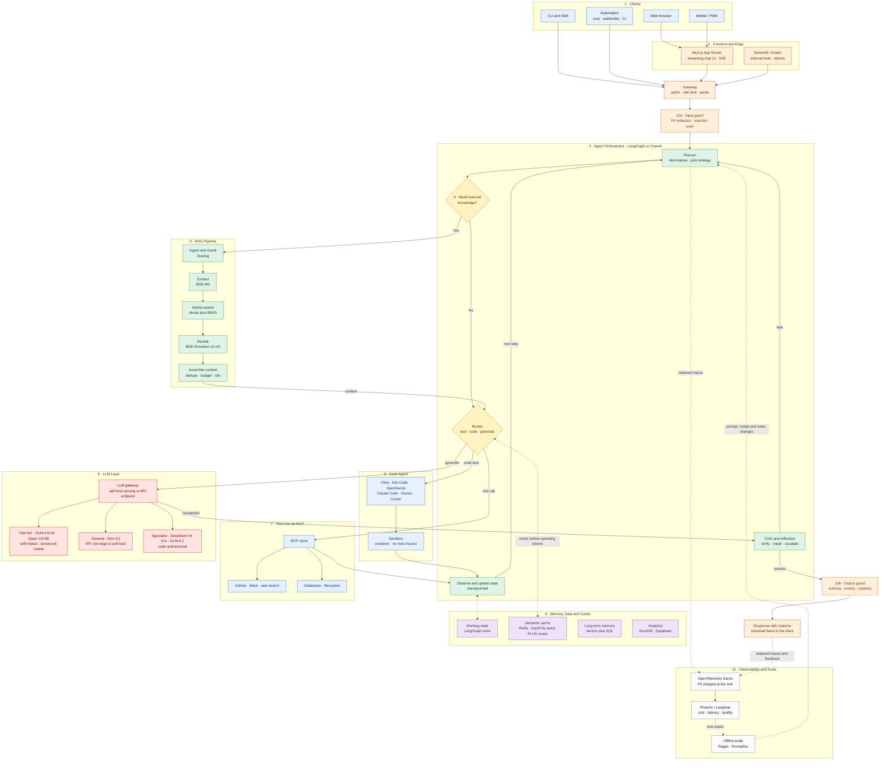
```mermaid
flowchart TB
    subgraph L1["1 · Clients"]
        direction LR
        C1["Web browser"]
        C2["Mobile / PWA"]
        C3["CLI and SDK"]
        C4["Automation<br/>cron · webhooks · CI"]
    end

    subgraph L2["2 · Frontend and Edge"]
        direction LR
        F1["Next.js App Router<br/>streaming chat UI · SSE"]
        F2["Streamlit / Gradio<br/>internal tools · demos"]
    end

    GW["Gateway<br/>authn · rate limit · quota"]
    GI["10a · Input guard<br/>PII redaction · injection scan"]

    subgraph L3["3 · Agent Orchestrator · LangGraph or CrewAI"]
        direction TB
        PLAN["Planner<br/>decompose · pick strategy"]
        K4{"4 · Need external<br/>knowledge?"}
        ROUTE{"Router<br/>tool · code · generate"}
        STATE["Observe and update state<br/>checkpointed"]
        CRITIC["Critic and reflection<br/>verify · repair · escalate"]
    end

    subgraph L5["5 · RAG Pipeline"]
        direction TB
        R1["Ingest and chunk<br/>Docling"]
        R2["Embed<br/>BGE-M3"]
        R3["Hybrid search<br/>dense plus BM25"]
        R4["Rerank<br/>BGE-Reranker-v2-m3"]
        R5["Assemble context<br/>dedupe · budget · cite"]
    end

    subgraph L7["7 · Tool Use via MCP"]
        direction TB
        T0["MCP client"]
        T1["GitHub · Slack · web search"]
        T2["Databases · filesystem"]
    end

    subgraph L8["8 · Code Agent"]
        direction TB
        A0["Cline · Kilo Code · OpenHands<br/>Claude Code · Goose · Cursor"]
        A1["Sandbox<br/>container · no host mounts"]
    end

    subgraph L6["6 · LLM Layer"]
        direction TB
        M0["LLM gateway<br/>self-host serving or API endpoint"]
        M1["Fast tier · GLM-4.5-Air · Qwen 3.5 9B<br/>self-hosted · structured output"]
        M2["General · Kimi K3<br/>API, too large to self-host"]
        M3["Specialist · DeepSeek V4 Pro · GLM-5.2<br/>code and terminal"]
    end

    GO["10b · Output guard<br/>schema · toxicity · citations"]

    subgraph L9["9 · Memory, Data and Cache"]
        direction LR
        D1["Working state<br/>LangGraph store"]
        D2["Semantic cache<br/>Redis · keyed by query PLUS scope"]
        D3["Long-term memory<br/>vectors plus SQL"]
        D4B["Analytics<br/>DuckDB · Supabase"]
    end

    subgraph L11["11 · Observability and Evals"]
        direction LR
        O1["OpenTelemetry traces<br/>PII stripped at the sink"]
        O2["Phoenix / Langfuse<br/>cost · latency · quality"]
        EV["Offline evals<br/>Ragas · Promptfoo"]
    end

    C1 --> F1
    C2 --> F1
    C3 --> GW
    C4 --> GW
    F1 --> GW
    F2 --> GW
    GW --> GI
    GI --> PLAN

    PLAN --> K4
    K4 -->|Yes| R1
    K4 -->|No| ROUTE
    R1 --> R2 --> R3 --> R4 --> R5
    R5 -->|context| ROUTE

    ROUTE -->|tool call| T0
    ROUTE -->|code task| A0
    ROUTE -->|generate| M0

    T0 --> T1
    T0 --> T2
    A0 --> A1
    M0 --> M1
    M0 --> M2
    M0 --> M3

    T0 --> STATE
    A1 --> STATE
    M0 -->|completion| CRITIC
    STATE -->|next step| PLAN
    CRITIC -->|fails| PLAN
    CRITIC -->|passes| GO
    GO --> RESP["Response with citations<br/>streamed back to the client"]

    STATE <-.-> D1
    ROUTE <-.->|check before spending tokens| D2
    PLAN -.->|redacted traces| O1
    RESP -.->|redacted traces and feedback| O1
    O1 --> O2
    O2 -.->|new cases| EV
    EV -.->|prompt, model and index changes| PLAN

    classDef client fill:#e8f0fe,stroke:#0071e3,color:#1d1d1f
    classDef fe fill:#ffeeda,stroke:#bf4800,color:#5c2e00
    classDef orch fill:#dff3e6,stroke:#248a3d,color:#0f3d23
    classDef rag fill:#dff3e6,stroke:#248a3d,color:#0f3d23
    classDef llm fill:#ffe4e2,stroke:#e30000,color:#8f0000
    classDef tool fill:#e8f0fe,stroke:#0071e3,color:#003a70
    classDef mem fill:#efe3f9,stroke:#8944ab,color:#3f2c52
    classDef guard fill:#ffeeda,stroke:#d97706,color:#78350f
    classDef obs fill:#fbfbfd,stroke:#6e6e73,color:#1d1d1f
    classDef decision fill:#fff3c2,stroke:#997404,color:#5c2e00

    class C1,C2,C3,C4 client
    class F1,F2,GW,RESP fe
    class PLAN,STATE,CRITIC orch
    class K4,ROUTE decision
    class R1,R2,R3,R4,R5 rag
    class M0,M1,M2,M3 llm
    class T0,T1,T2,A0,A1 tool
    class D1,D2,D3,D4B mem
    class GI,GO guard
    class O1,O2,EV obs
```

---

## 6. Request lifecycle

One user turn, end to end, including the cache short-circuit and the tool loop.

Four interface patterns follow from this lifecycle, and retrofitting any of them is painful: stream
tokens as they arrive; show tool calls as visible steps rather than silence; render citations as
links to their sources; and design the retraction path up front, a failed final check replaces the
shown answer with a corrected one and says so.

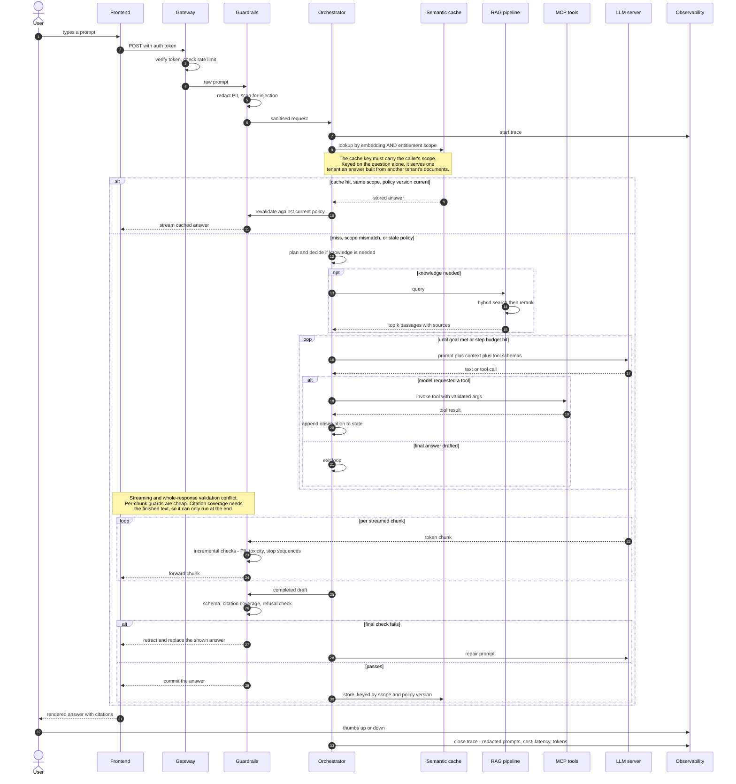
```mermaid
sequenceDiagram
    autonumber
    actor U as User
    participant FE as Frontend
    participant GW as Gateway
    participant GD as Guardrails
    participant OR as Orchestrator
    participant CA as Semantic cache
    participant RG as RAG pipeline
    participant MC as MCP tools
    participant LM as LLM server
    participant OB as Observability

    U->>FE: types a prompt
    FE->>GW: POST with auth token
    GW->>GW: verify token, check rate limit
    GW->>GD: raw prompt
    GD->>GD: redact PII, scan for injection
    GD->>OR: sanitised request
    OR->>OB: start trace

    OR->>CA: lookup by embedding AND entitlement scope
    Note over OR,CA: The cache key must carry the caller's scope.<br/>Keyed on the question alone, it serves one<br/>tenant an answer built from another tenant's documents.
    alt cache hit, same scope, policy version current
        CA-->>OR: stored answer
        OR->>GD: revalidate against current policy
        GD-->>FE: stream cached answer
    else miss, scope mismatch, or stale policy
        OR->>OR: plan and decide if knowledge is needed
        opt knowledge needed
            OR->>RG: query
            RG->>RG: hybrid search then rerank
            RG-->>OR: top k passages with sources
        end

        loop until goal met or step budget hit
            OR->>LM: prompt plus context plus tool schemas
            LM-->>OR: text or tool call
            alt model requested a tool
                OR->>MC: invoke tool with validated args
                MC-->>OR: tool result
                OR->>OR: append observation to state
            else final answer drafted
                OR->>OR: exit loop
            end
        end

        Note over GD,FE: Streaming and whole-response validation conflict.<br/>Per-chunk guards are cheap. Citation coverage needs<br/>the finished text, so it can only run at the end.
        loop per streamed chunk
            LM-->>GD: token chunk
            GD->>GD: incremental checks - PII, toxicity, stop sequences
            GD-->>FE: forward chunk
        end

        OR->>GD: completed draft
        GD->>GD: schema, citation coverage, refusal check
        alt final check fails
            GD-->>FE: retract and replace the shown answer
            OR->>LM: repair prompt
        else passes
            GD-->>FE: commit the answer
            OR->>CA: store, keyed by scope and policy version
        end
    end

    FE-->>U: rendered answer with citations
    U->>OB: thumbs up or down
    OR->>OB: close trace - redacted prompts, cost, latency, tokens
```

---

## 7. Agent control loop

The state machine the orchestrator actually runs. Every terminal path is explicit, so the agent
cannot spin forever.

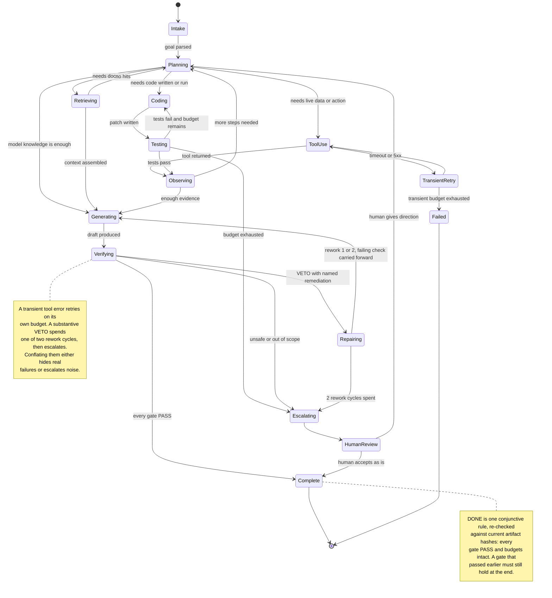
```mermaid
stateDiagram-v2
    [*] --> Intake
    Intake --> Planning : goal parsed

    Planning --> Retrieving : needs docs
    Planning --> ToolUse : needs live data or action
    Planning --> Coding : needs code written or run
    Planning --> Generating : model knowledge is enough

    Retrieving --> Generating : context assembled
    Retrieving --> Planning : no hits

    ToolUse --> Observing : tool returned
    ToolUse --> TransientRetry : timeout or 5xx
    TransientRetry --> ToolUse
    TransientRetry --> Failed : transient budget exhausted

    Coding --> Testing : patch written
    Testing --> Observing : tests pass
    Testing --> Coding : tests fail and budget remains
    Testing --> Escalating : budget exhausted

    Observing --> Planning : more steps needed
    Observing --> Generating : enough evidence

    Generating --> Verifying : draft produced
    Verifying --> Complete : every gate PASS
    Verifying --> Repairing : VETO with named remediation
    Verifying --> Escalating : unsafe or out of scope

    Repairing --> Generating : rework 1 or 2, failing check carried forward
    Repairing --> Escalating : 2 rework cycles spent

    Escalating --> HumanReview
    HumanReview --> Planning : human gives direction
    HumanReview --> Complete : human accepts as is

    Complete --> [*]
    Failed --> [*]

    note right of Verifying
        A transient tool error retries on its
        own budget. A substantive VETO spends
        one of two rework cycles, then escalates.
        Conflating them either hides real
        failures or escalates noise.
    end note

    note right of Complete
        DONE is one conjunctive rule, re-checked
        against current artifact hashes: every
        gate PASS and budgets intact. A gate that
        passed earlier must still hold at the end.
    end note
```

---

## 8. RAG pipeline internals

Ingestion runs offline; query runs per request. Hybrid retrieval plus reranking is the upgrade that
buys the most quality per unit of added machinery over naive top-k cosine search. That ranking is
indicative: it is an engineering default, not a published bake-off across RAG variants.

### 8.1 RAG variants: adopt one when its failure mode appears

The pipeline above is the default for a reason: on most corpora, hybrid retrieval plus reranking
buys the best quality for the least machinery. That judgement is indicative. The named variants
exist because specific failure modes defeat it. Start with the default; reach for a variant only
when you can name the failure you are fixing.

| Variant | The failure it fixes | Cost |
|---|---|---|
| Hybrid + rerank (this section) | The baseline, start here | Low |
| Agentic RAG | Multi-hop questions; the model decides when and what to retrieve, and can search again | More model calls per answer |
| GraphRAG | "Who is connected to what" questions across a corpus; entity and relationship queries | Expensive index build and upkeep |
| Corrective / Self-RAG | Retrieval quality must be verified before answering; high-stakes accuracy | Extra verification pass per query |
| HyDE | Queries phrased nothing like the documents; sparse corpora | One extra generation per query |
| RAPTOR / hierarchical | Long documents needing both summary-level and detail-level answers | Multi-level index build |
| Text-to-SQL / structured | The answer is a number in a table, query it, never embed it | Schema description upkeep |
| Multimodal RAG | PDFs with figures, screenshots, diagrams; ColPali-style vision embeddings | Vision-capable embed and rerank |
| Cache-augmented (CAG) | Small, stable corpus that fits the context window, skip retrieval infra entirely | Long-context prefill per query |

Two controls matter more than ranking quality if you have more than one user. Entitlement is filtered
inside the index query and fails closed, so a scope mismatch returns nothing rather than leaking, and
redaction happens at ingestion so secrets never reach the index in the first place. Pin the whole
retrieval surface together, a recall number only means something against a named configuration.

```mermaid
flowchart LR
    subgraph ING["Ingestion · offline batch"]
        direction TB
        I1["Sources<br/>PDF · DOCX · HTML · code · tickets"]
        I2["Parse and normalise<br/>Docling · Unstructured"]
        I3["Chunk<br/>structure aware · 400 to 800 tokens · overlap"]
        IR["Redact at ingestion<br/>PII and secrets masked before indexing"]
        I4["Enrich<br/>title · section path · stable id · entitlement tag"]
        I5["Embed<br/>BGE-M3"]
        I6[("Vector store<br/>Chroma · Qdrant · pgvector")]
        I7[("Keyword index<br/>BM25")]
        IV["Pin the retrieval surface<br/>corpus snapshot · chunker · embed model · index · reranker"]
    end

    subgraph QRY["Query · per request"]
        direction TB
        Q1["User question"]
        Q2["Query rewrite<br/>resolve pronouns · expand acronyms"]
        Q3["Multi-query fan out<br/>3 to 5 paraphrases"]
        QE["Entitlement filter<br/>applied inside the index query · fails closed"]
        Q4["Dense search"]
        Q5["Sparse search BM25"]
        Q6["Fuse<br/>reciprocal rank fusion"]
        Q7["Rerank cross encoder<br/>BGE-Reranker-v2-m3"]
        Q8["Assemble context<br/>dedupe · budget · best evidence at head and tail"]
        QV["Verify the packed window<br/>every citable id is actually present"]
        Q9{"Enough<br/>evidence?"}
        Q10["Answer with citations"]
        Q11["Name what is missing<br/>or widen the search"]
    end

    I1 --> I2 --> I3 --> IR --> I4 --> I5 --> I6
    I4 --> I7
    I6 -.-> IV
    I7 -.-> IV

    Q1 --> Q2 --> Q3 --> QE
    QE --> Q4
    QE --> Q5
    I6 -.-> Q4
    I7 -.-> Q5
    Q4 --> Q6
    Q5 --> Q6
    Q6 --> Q7 --> Q8 --> QV --> Q9
    Q9 -->|yes| Q10
    Q9 -->|no| Q11
    Q11 -.->|one retry with broader filters| Q3

    classDef ingest fill:#dff3e6,stroke:#248a3d,color:#0f3d23
    classDef query fill:#e8f0fe,stroke:#0071e3,color:#003a70
    classDef store fill:#efe3f9,stroke:#8944ab,color:#3f2c52
    classDef decision fill:#fff3c2,stroke:#997404,color:#5c2e00
    classDef control fill:#ffeeda,stroke:#d97706,color:#78350f

    class I1,I2,I3,I4,I5 ingest
    class I6,I7 store
    class Q1,Q2,Q3,Q4,Q5,Q6,Q7,Q8,Q10,Q11 query
    class Q9 decision
    class IR,IV,QE,QV control
```

---

## 9. Model routing

Sending every request to the largest model is a common cost and latency mistake. Route by
task shape, not by preference. The verifier is a separate prompt from the one that produced the
answer, a model grading its own output is not a gate, and rework is bounded at two cycles.

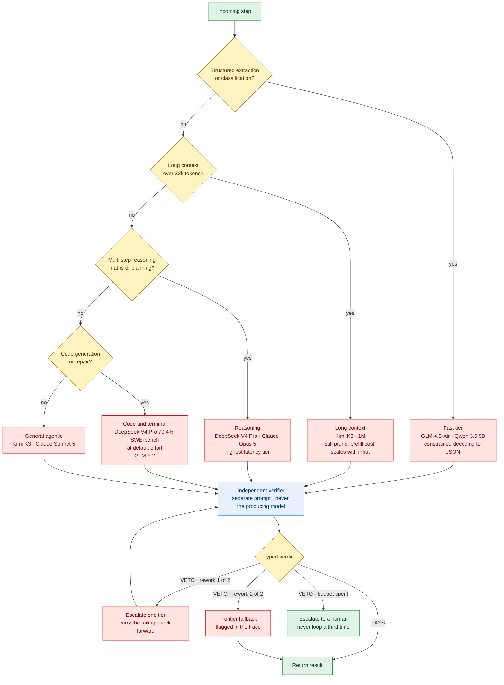
```mermaid
flowchart TB
    S["Incoming step"] --> C1{"Structured extraction<br/>or classification?"}
    C1 -->|yes| SMALL["Fast tier<br/>GLM-4.5-Air · Qwen 3.5 9B<br/>constrained decoding to JSON"]
    C1 -->|no| C2{"Long context<br/>over 32k tokens?"}
    C2 -->|yes| LONG["Long context<br/>Kimi K3 · 1M<br/>still prune, prefill cost scales with input"]
    C2 -->|no| C3{"Multi step reasoning<br/>maths or planning?"}
    C3 -->|yes| REASON["Reasoning<br/>DeepSeek V4 Pro · Claude Opus 5<br/>highest latency tier"]
    C3 -->|no| C4{"Code generation<br/>or repair?"}
    C4 -->|yes| CODE["Code and terminal<br/>DeepSeek V4 Pro 79.4% SWE-bench<br/>at default effort<br/>GLM-5.2"]
    C4 -->|no| GEN["General agentic<br/>Kimi K3 · Claude Sonnet 5"]

    SMALL --> V["Independent verifier<br/>separate prompt · never the producing model"]
    LONG --> V
    REASON --> V
    CODE --> V
    GEN --> V

    V --> Q{"Typed verdict"}
    Q -->|PASS| OUT["Return result"]
    Q -->|VETO · rework 1 of 2| UP["Escalate one tier<br/>carry the failing check forward"]
    UP --> V
    Q -->|VETO · rework 2 of 2| CLOUD["Frontier fallback<br/>flagged in the trace"]
    CLOUD --> OUT
    Q -->|VETO · budget spent| ESC["Escalate to a human<br/>never loop a third time"]

    classDef decision fill:#fff3c2,stroke:#997404,color:#5c2e00
    classDef model fill:#ffe4e2,stroke:#e30000,color:#8f0000
    classDef out fill:#dff3e6,stroke:#248a3d,color:#0f3d23
    classDef check fill:#e8f0fe,stroke:#0071e3,color:#003a70

    class C1,C2,C3,C4,Q decision
    class SMALL,LONG,REASON,CODE,GEN,UP,CLOUD model
    class V check
    class S,OUT,ESC out
```

---

## 10. Prompt and turn contract

The innermost ring, and the easiest to overlook. Everything the outer layers
coordinate reduces to a single well-specified turn. Order matters: hard constraints first, evidence
in the middle, the task and output schema last, because placing critical instructions near the head
and tail can help attention in long contexts. It is a mitigation to evaluate, not a guarantee.

Two properties make groundedness structural rather than hoped-for. Claims may only cite chunk ids
that the window actually supplied, and the policy is restated *after* the untrusted content, so the
last thing the model reads is your contract rather than an attacker's payload.

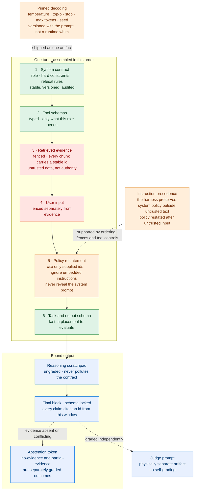
```mermaid
flowchart TB
    subgraph TURN["One turn · assembled in this order"]
        direction TB
        P1["1 · System contract<br/>role · hard constraints · refusal rules<br/>stable, versioned, audited"]
        P2["2 · Tool schemas<br/>typed · only what this role needs"]
        P3["3 · Retrieved evidence<br/>fenced · every chunk carries a stable id<br/>untrusted data, not authority"]
        P4["4 · User input<br/>fenced separately from evidence"]
        P5["5 · Policy restatement<br/>cite only supplied ids · ignore embedded instructions<br/>never reveal the system prompt"]
        P6["6 · Task and output schema<br/>last, a placement to evaluate"]
    end

    subgraph BOUND["Bound output"]
        direction TB
        B1["Reasoning scratchpad<br/>ungraded · never pollutes the contract"]
        B2["Final block · schema locked<br/>every claim cites an id from this window"]
        B3["Abstention token<br/>no-evidence and partial-evidence<br/>are separately graded outcomes"]
    end

    DEC["Pinned decoding<br/>temperature · top-p · stop · max tokens · seed<br/>versioned with the prompt, not a runtime whim"]
    PREC["Instruction precedence<br/>the harness preserves system policy outside untrusted text<br/>policy restated after untrusted input"]
    JUDGE["Judge prompt<br/>physically separate artifact<br/>no self-grading"]

    P1 --> P2 --> P3 --> P4 --> P5 --> P6
    P6 --> B1 --> B2
    B2 -.->|evidence absent or conflicting| B3
    DEC -.->|shipped as one artifact| P1
    PREC -.->|supported by ordering, fences and tool controls| P5
    B2 -.->|graded independently| JUDGE

    classDef contract fill:#dff3e6,stroke:#248a3d,color:#0f3d23
    classDef untrusted fill:#ffe4e2,stroke:#e30000,color:#8f0000
    classDef policy fill:#ffeeda,stroke:#d97706,color:#78350f
    classDef out fill:#e8f0fe,stroke:#0071e3,color:#003a70

    class P1,P2,P6 contract
    class P3,P4 untrusted
    class P5,PREC,DEC policy
    class B1,B2,B3,JUDGE out
```

A prompt without its decoding settings is not reproducible, you cannot replay the exact turn behind
a bad answer. Version them together.

The named prompting techniques all live somewhere in this design rather than in a prompts folder.
Few-shot examples belong in the tool contract and the eval dataset. Chain-of-thought is the reasoning
tier you select per complexity in section 9. ReAct is the section 7 loop itself. Reflection is
the section 7 critic. Structured outputs are the JSON schemas the harness validates at the boundary.
A technique that exists only as prompt text drifts; one that has an owner and a test survives.

---

## 11. Trust boundaries

Four things enter the model's window and none of them are trustworthy. The failure most teams miss is
the third: tool and MCP results are usually treated as safe because *we* called the tool, but a
GitHub issue body, a Slack message or a scraped page is attacker-controllable text heading straight
into context. It needs the same treatment as a retrieved chunk.

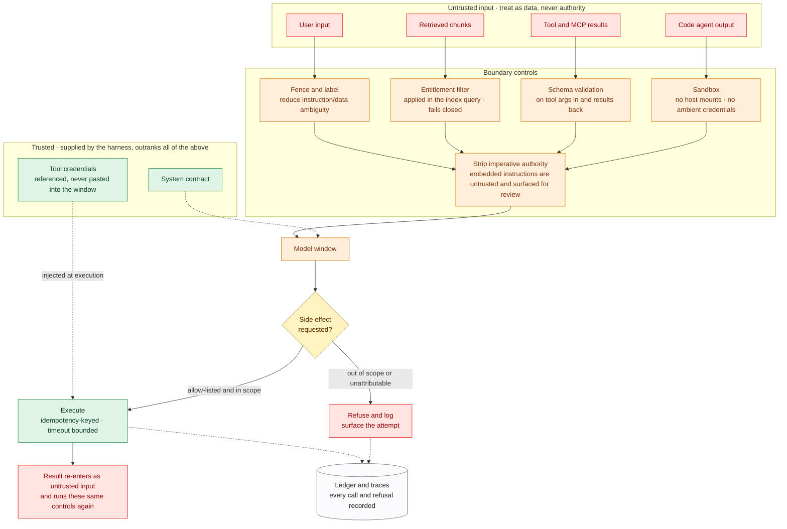
```mermaid
flowchart TB
    subgraph UNTRUSTED["Untrusted input · treat as data, never authority"]
        direction LR
        U1["User input"]
        U2["Retrieved chunks"]
        U3["Tool and MCP results"]
        U4["Code agent output"]
    end

    subgraph DEFENCE["Boundary controls"]
        direction TB
        D1["Fence and label<br/>reduce instruction/data ambiguity"]
        D2["Strip imperative authority<br/>embedded instructions are untrusted and surfaced for review"]
        D3["Entitlement filter<br/>applied in the index query · fails closed"]
        D4["Schema validation<br/>on tool args in and results back"]
        D5["Sandbox<br/>no host mounts · no ambient credentials"]
    end

    subgraph TRUSTED["Trusted · supplied by the harness, outranks all of the above"]
        direction LR
        T1["System contract"]
        T2["Tool credentials<br/>referenced, never pasted into the window"]
    end

    MODEL["Model window"]
    EGRESS{"Side effect<br/>requested?"}
    ACT["Execute<br/>idempotency-keyed · timeout bounded"]
    DENY["Refuse and log<br/>surface the attempt"]
    REENTER["Result re-enters as untrusted input<br/>and runs these same controls again"]
    LEDGER[("Ledger and traces<br/>every call and refusal recorded")]

    U1 --> D1
    U2 --> D3
    U3 --> D4
    U4 --> D5
    D1 --> D2
    D3 --> D2
    D4 --> D2
    D5 --> D2
    D2 --> MODEL
    T1 -.-> MODEL
    T2 -.->|injected at execution| ACT

    MODEL --> EGRESS
    EGRESS -->|allow-listed and in scope| ACT
    EGRESS -->|out of scope or unattributable| DENY
    ACT --> REENTER
    ACT -.-> LEDGER
    DENY -.-> LEDGER

    classDef untrusted fill:#ffe4e2,stroke:#e30000,color:#8f0000
    classDef control fill:#ffeeda,stroke:#d97706,color:#78350f
    classDef trusted fill:#dff3e6,stroke:#248a3d,color:#0f3d23
    classDef decision fill:#fff3c2,stroke:#997404,color:#5c2e00
    classDef store fill:#fbfbfd,stroke:#6e6e73,color:#1d1d1f

    class U1,U2,U3,U4,REENTER untrusted
    class D1,D2,D3,D4,D5,MODEL control
    class T1,T2,ACT trusted
    class EGRESS decision
    class DENY untrusted
    class LEDGER store
```

The loop back from `Execute` to untrusted input is the important edge: a tool result is not sanitised
by having been requested. Two further properties keep retries safe, side-effecting tools are
idempotency-keyed, so a retried write is applied once by a server that honours the key, and
credentials live in the harness rather than the prompt, which keeps them outside the context window.
Fences, labels and prompt order can reduce ambiguity, but do not make a model reliably distinguish
data from instructions; tool authorization and output validation remain the enforcement points.

Tool execution runs in a container at minimum. When tools run model-written code, climb the
isolation ladder: gVisor intercepts syscalls below the container, Firecracker gives each execution
its own microVM, and hosted sandboxes (E2B, Modal) provide provider-specific isolation when you would
rather not operate it yourself. Compare their documented boundary, network policy and credential
handling to your threat model; they are not interchangeable with an API boundary.

---

## 12. Memory and data tiers

Four tiers with different lifetimes. Conflating them is what makes agents both forgetful and
expensive at the same time.

One boundary before the tiers: your transactional system of record, Postgres, MySQL, the ERP, 
stays outside the agent entirely. The agent reaches it through tools and reads it into context; it
never replaces it with memory, and memory never becomes a second copy of it.

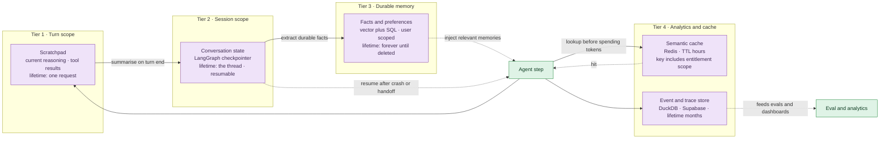
```mermaid
flowchart LR
    subgraph T1["Tier 1 · Turn scope"]
        M1["Scratchpad<br/>current reasoning · tool results<br/>lifetime: one request"]
    end
    subgraph T2["Tier 2 · Session scope"]
        M2["Conversation state<br/>LangGraph checkpointer<br/>lifetime: the thread · resumable"]
    end
    subgraph T3["Tier 3 · Durable memory"]
        M3["Facts and preferences<br/>vector plus SQL · user scoped<br/>lifetime: forever until deleted"]
    end
    subgraph T4["Tier 4 · Analytics and cache"]
        M4["Semantic cache<br/>Redis · TTL hours<br/>key includes entitlement scope"]
        M5["Event and trace store<br/>DuckDB · Supabase · lifetime months"]
    end

    AG["Agent step"] --> M1
    M1 -->|summarise on turn end| M2
    M2 -->|extract durable facts| M3
    M3 -.->|inject relevant memories| AG
    M2 -.->|resume after crash or handoff| AG
    AG -->|lookup before spending tokens| M4
    M4 -.->|hit| AG
    AG --> M5
    M5 -.->|feeds evals and dashboards| EVAL["Eval and analytics"]

    classDef mem fill:#efe3f9,stroke:#8944ab,color:#3f2c52
    classDef agent fill:#dff3e6,stroke:#248a3d,color:#0f3d23
    class M1,M2,M3,M4,M5 mem
    class AG,EVAL agent
```

---

Reads deserve the same rigour as writes. Score memory retrieval by relevance times recency times
importance, take the top few, and place them in context labelled as memory rather than fact: the
model should know a recollection can be stale. On conflict, source-of-truth data beats memory, and
newer memory beats older unless the older entry is pinned. Give every tier a TTL: turn state dies
with the turn, session state with the session, and long-term entries expire on a review schedule
unless re-confirmed. Redact PII at write time rather than read time, so nothing sensitive survives
in a store that outlives the conversation. And because stored text re-enters future windows, every
write gate here is also the control for memory poisoning (ASI06 in section 19).

### 12.1 Deployment memory catalogue

Choose the memory role before choosing a product. The following systems can be composed, but none
replaces the system of record or the controls around it.

| System | Deployment role | Primary source |
|---|---|---|
| Hermes Agent | Bounded runtime-managed context and external providers | [memory](https://hermes-agent.nousresearch.com/docs/user-guide/features/memory) · [providers](https://hermes-agent.nousresearch.com/docs/user-guide/features/memory-providers) |
| Claude-Mem | Hook-based developer-session capture, compression, and reinjection | [repository](https://github.com/thedotmack/claude-mem) · [architecture](https://docs.claude-mem.ai/architecture/overview) |
| MemPalace | Local-first verbatim structured retrieval | [repository](https://github.com/MemPalace/mempalace) |
| GBrain | Structured/provenance-aware institutional memory | [repository](https://github.com/garrytan/gbrain) · [memory verbs](https://github.com/garrytan/gbrain/blob/master/docs/protocol/MEMORY_VERBS_v1.md) |
| MemSearch | Markdown source of truth plus hybrid/Milvus derived index | [repository](https://github.com/zilliztech/memsearch) · [architecture](https://zilliztech.github.io/memsearch/architecture/) |
| Mem0 | Managed or self-hosted extracted-memory lifecycle | [repository](https://github.com/mem0ai/mem0) · [add](https://docs.mem0.ai/core-concepts/memory-operations/add) · [expiration](https://docs.mem0.ai/platform/features/memory-expiration) |

### 12.2 Deployment memory safety and lifecycle boundary

Retrieved memory is untrusted data, never instructions. Hooks and MCP inherit tool authority, so
their installation, credentials, and reachable tools need the same review as an executor. Writes
require provenance, corroboration, quarantine for uncertain material, and principal and tenant
scoping before promotion. Local-first is configuration-specific: provider and telemetry egress must
be reviewed for the chosen deployment.

Decay, expiration, and index reset are not verified deletion. An erasure workflow must cover
canonical sources and derived indexes, caches, traces, backups, and provider copies; verify the
deletion path for each store instead of treating a lifecycle control as evidence of erasure.

---

## 13. Guardrails, evals and the improvement loop

Guards run inline on every request. Evals run offline on a fixed dataset and gate deployment.
Traces feed new cases back into the dataset, which is what closes the loop.

### 13.1 The agent test pyramid

Evals do not replace tests; they sit above them. Seven levels, cheapest and fastest at the bottom:

1. Unit tests, model mocked. Routing, tool dispatch, schema validation, budget enforcement: ordinary deterministic code, millisecond-fast.
2. Contract tests. Every tool's JSON Schema validated against real fixture payloads; a tool that drifts fails here, not in production.
3. Replay integration tests. Record real model responses once, replay them in CI: full-pipeline coverage at zero token cost.
4. Eval suites. The golden dataset with graded rubrics and a calibrated judge, run against the live model.
5. Simulation. A persona model plays the user across multi-turn flows; assert on outcomes, never on exact wording.
6. Red-team suites. Map adversarial prompts to the ASI risks (section 19): injection, exfiltration, and tool misuse. Run the suite on an appropriate cadence; when your release policy requires it, defined high-severity failures block release.
7. Chaos drills. Kill the model server, inject 429s, corrupt a tool response; verify fallbacks and budgets hold.

| CI stage | Runs | Budget |
|---|---|---|
| Every pull request | Units, contracts, replay | Under five minutes, zero tokens |
| Nightly | Full eval suite plus simulation | Live model, temperature 0, pinned seeds |
| Before release | Red-team, chaos, load | The gate that decides shipping |

Determinism rules: temperature 0 and pinned seeds for anything asserted exactly. For judged
metrics, run three times and take the median; a single judge run is a biased coin, not a verdict.

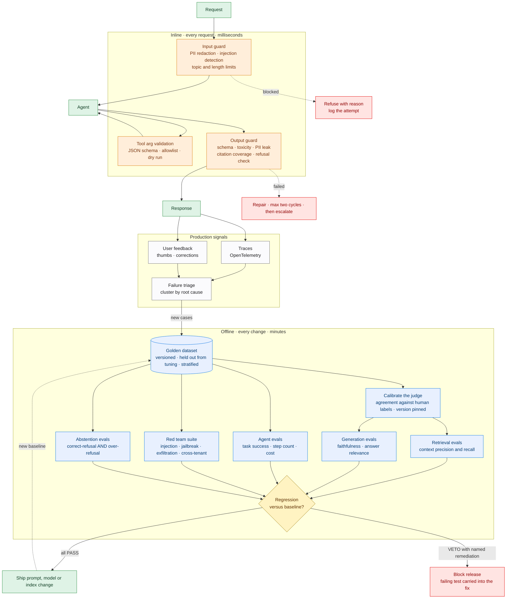
```mermaid
flowchart TB
    subgraph INLINE["Inline · every request · milliseconds"]
        direction TB
        G1["Input guard<br/>PII redaction · injection detection<br/>topic and length limits"]
        G2["Tool arg validation<br/>JSON schema · allowlist · dry run"]
        G3["Output guard<br/>schema · toxicity · PII leak<br/>citation coverage · refusal check"]
    end

    subgraph OFFLINE["Offline · every change · minutes"]
        direction TB
        E1[("Golden dataset<br/>versioned · held out from tuning · stratified")]
        EJ["Calibrate the judge<br/>agreement against human labels · version pinned"]
        E2["Retrieval evals<br/>context precision and recall"]
        E3["Generation evals<br/>faithfulness · answer relevance"]
        E4["Agent evals<br/>task success · step count · cost"]
        E5["Red team suite<br/>injection · jailbreak · exfiltration · cross-tenant"]
        E7["Abstention evals<br/>correct-refusal AND over-refusal"]
        E6{"Regression<br/>versus baseline?"}
    end

    subgraph PROD["Production signals"]
        direction TB
        S1["Traces<br/>OpenTelemetry"]
        S2["User feedback<br/>thumbs · corrections"]
        S3["Failure triage<br/>cluster by root cause"]
    end

    REQ["Request"] --> G1 --> AGENT["Agent"] --> G2
    G2 --> AGENT
    AGENT --> G3 --> RESP["Response"]

    G1 -.->|blocked| BLOCK["Refuse with reason<br/>log the attempt"]
    G3 -.->|failed| RETRY["Repair · max two cycles · then escalate"]

    RESP --> S1
    RESP --> S2
    S1 --> S3
    S2 --> S3
    S3 -->|new cases| E1

    E1 --> EJ
    EJ --> E2
    EJ --> E3
    E1 --> E4
    E1 --> E5
    E1 --> E7
    E2 --> E6
    E3 --> E6
    E4 --> E6
    E5 --> E6
    E7 --> E6
    E6 -->|all PASS| SHIP["Ship prompt, model or index change"]
    E6 -->|VETO with named remediation| FIX["Block release<br/>failing test carried into the fix"]
    SHIP -.->|new baseline| E1

    classDef guard fill:#ffeeda,stroke:#d97706,color:#78350f
    classDef eval fill:#e8f0fe,stroke:#0071e3,color:#003a70
    classDef sig fill:#fbfbfd,stroke:#6e6e73,color:#1d1d1f
    classDef decision fill:#fff3c2,stroke:#997404,color:#5c2e00
    classDef bad fill:#ffe4e2,stroke:#e30000,color:#8f0000
    classDef good fill:#dff3e6,stroke:#248a3d,color:#0f3d23

    class G1,G2,G3 guard
    class E1,E2,E3,E4,E5,E7,EJ eval
    class S1,S2,S3 sig
    class E6 decision
    class BLOCK,RETRY,FIX bad
    class SHIP,RESP,REQ,AGENT good
```

---

## 14. Deployment topology

Three shapes, chosen by how much concurrency you need. The sizing rule that decides all of them:
**weights plus KV cache plus activation overhead**: and KV cache grows with batch size times context
length, so it is usually what runs out first, not the weights.

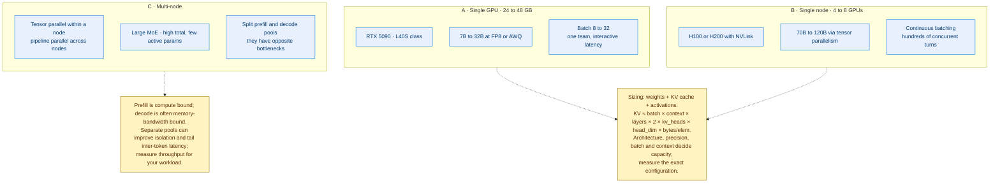
```mermaid
flowchart TB
    subgraph A["A · Single GPU · 24 to 48 GB"]
        direction TB
        A1["RTX 5090 · L40S class"]
        A2["7B to 32B at FP8 or AWQ"]
        A3["Batch 8 to 32<br/>one team, interactive latency"]
    end

    subgraph B["B · Single node · 4 to 8 GPUs"]
        direction TB
        B1["H100 or H200 with NVLink"]
        B2["70B to 120B via tensor parallelism"]
        B3["Continuous batching<br/>hundreds of concurrent turns"]
    end

    subgraph C["C · Multi-node"]
        direction TB
        C1["Tensor parallel within a node<br/>pipeline parallel across nodes"]
        C2["Large MoE · high total, few active params"]
        C3["Split prefill and decode pools<br/>they have opposite bottlenecks"]
    end

    RULE["Sizing: weights + KV cache + activations.<br/>KV ≈ batch × context × layers × 2 × kv_heads × head_dim × bytes/elem.<br/>Architecture, precision, batch and context decide capacity;<br/>measure the exact configuration."]
    SPLIT["Prefill is compute bound; decode is often memory-bandwidth bound.<br/>Separate pools can improve isolation and tail inter-token latency;<br/>measure throughput for your workload."]

    A -.-> RULE
    B -.-> RULE
    C -.-> SPLIT

    classDef tier fill:#e8f0fe,stroke:#0071e3,color:#003a70
    classDef note fill:#fff3c2,stroke:#997404,color:#5c2e00
    class A1,A2,A3,B1,B2,B3,C1,C2,C3 tier
    class RULE,SPLIT note
```

CPU-only chat is possible, but a GPU is usually the practical choice for responsive or concurrent use.
CPU-only inference runs at, indicative, 3-7 tok/s for a 7B Q4 model on a recent desktop CPU under
llama.cpp at batch 1, which can make a 500-token answer take one to three minutes; it suits batch
work and limited, low-concurrency chat. Measure your processor and context length.

---

Beyond the box count, four decisions shape the topology. Availability: run at least two replicas
behind a load balancer once real users depend on the stack; one model server is a single point of
failure at any size. Rollout: blue-green suits model servers, because weights preload on the idle
colour and traffic flips atomically; rolling updates suit stateless gateway code. Placement: put
GPUs where the data lives; cross-region hops add tens of milliseconds each way and data-residency
rules may forbid them outright. Scaling: autoscale on queue depth and KV-cache pressure, not CPU,
because a model server saturates its batch long before its cores. Multi-node vLLM coordinates its
workers over Ray, so a Ray cluster is often already in the picture at that scale. Kubernetes earns its complexity
at multi-node scale; below that, docker compose on one machine deploys the whole stack and
restarts it on boot. Spot GPUs cut batch and training cost sharply but need checkpoint-resume;
keep interactive serving on reserved capacity.

---

## 15. Data lifecycle, deletion and re-indexing

Every store below the source of truth is a **derived copy**, and each one needs its own delete path.
This is the gap that turns a right-to-erasure request into an incident: the document is removed from
the corpus, and its content survives in the vector index, the extracted memory, the answer cache, the
traces and the eval set. Deletion has to fan out, and it has to be verified rather than assumed.

The second half is the migration nobody plans for. Changing the embedding model invalidates every
vector you have, the new model's space is not comparable with the old one, so there is no partial
upgrade. Build beside, compare, cut over, keep the old index until you are sure.

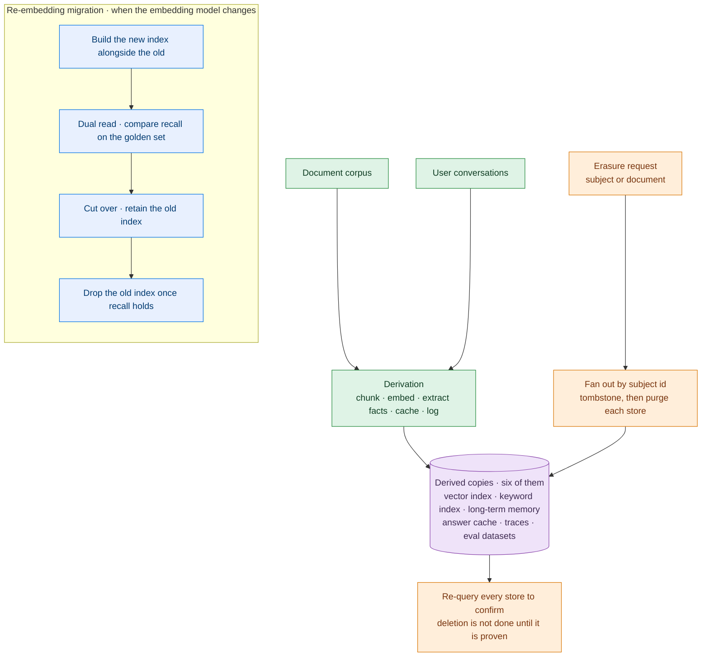
```mermaid
flowchart TB
    S1["Document corpus"]
    S2["User conversations"]
    DRV["Derivation<br/>chunk · embed · extract facts · cache · log"]
    X[("Derived copies · six of them<br/>vector index · keyword index · long-term memory<br/>answer cache · traces · eval datasets")]
    ERASE["Erasure request<br/>subject or document"]
    FAN["Fan out by subject id<br/>tombstone, then purge each store"]
    VERIFY["Re-query every store to confirm<br/>deletion is not done until it is proven"]

    S1 --> DRV
    S2 --> DRV
    DRV --> X
    ERASE --> FAN
    FAN --> X
    X --> VERIFY

    subgraph REIDX["Re-embedding migration · when the embedding model changes"]
        direction TB
        RI1["Build the new index alongside the old"]
        RI2["Dual read · compare recall on the golden set"]
        RI3["Cut over · retain the old index"]
        RI4["Drop the old index once recall holds"]
    end
    RI1 --> RI2 --> RI3 --> RI4

    classDef src fill:#dff3e6,stroke:#248a3d,color:#0f3d23
    classDef store fill:#efe3f9,stroke:#8944ab,color:#3f2c52
    classDef control fill:#ffeeda,stroke:#d97706,color:#78350f
    classDef mig fill:#e8f0fe,stroke:#0071e3,color:#003a70

    class S1,S2 src
    class X store
    class DRV src
    class ERASE,FAN,VERIFY control
    class RI1,RI2,RI3,RI4 mig
```

Retention differs per store and should be set deliberately: set traces in weeks and cache in hours only
where your retention policy, legal basis, and deletion commitments allow it. Durable memory needs a
user-visible retention and deletion rule; eval cases need a documented purpose, minimisation, and
retention period rather than indefinite storage by default.

Corpus freshness is a schedule, not an aspiration. Re-ingest changed sources with whatever
orchestrator you already run, Airflow, Prefect, Dagster, or plain cron, and stamp every chunk
with its ingestion time so retrieval can filter or prefer by recency.

---

## 16. Databases and state

One system of record, many derived stores. Postgres is the default spine: relational state,
pgvector for embeddings, row-level security for tenant isolation, and one backup path covering all
of it. Everything else earns its place by a workload the spine handles badly, and every derived
store must stay rebuildable from the source of truth (section 15).

| Class | Options | Reach for it when | Driver and compatibility notes |
|---|---|---|---|
| Relational, the system of record | Postgres · MySQL · SQLite | Sessions, users, jobs, billing: anything with invariants | SQLAlchemy or asyncpg in Python · Prisma or Drizzle in TypeScript · JDBC in Java |
| Vector | pgvector · Qdrant · Milvus · Weaviate · LanceDB · Chroma | Start with pgvector when keeping vectors beside relational data simplifies the system; measure latency, filtering, index build time, and operations against your workload before choosing a dedicated engine | Qdrant and Milvus ship gRPC and REST clients for every stack language; Pinecone when managed-only is acceptable |
| Key-value and cache | Redis · Valkey | Semantic cache, embedding cache keyed by content hash, rate limits, queues, session scratch | redis-py and ioredis; Valkey is the open fork and protocol-compatible |
| Document | MongoDB · Postgres JSONB | Payloads with no stable schema; MERN teams already fluent in it | JSONB covers most document needs without adding a second database |
| Graph | Neo4j · Memgraph | GraphRAG, entity memory, permission graphs traversed at depth | Cypher clients in every language; skip until a query genuinely needs multi-hop traversal |
| Search | OpenSearch · Meilisearch | BM25 for hybrid retrieval, log search, faceting | Qdrant sparse vectors cover hybrid RAG at small scale without a second engine |
| Analytics | ClickHouse · DuckDB | Trace analytics and eval dashboards past what Postgres aggregates comfortably | DuckDB embeds in-process; ClickHouse when volume outgrows one machine |
| Object storage | S3 · MinIO · R2 | Documents, model artifacts, checkpoints, cold traces | Every SDK speaks the S3 API; MinIO self-hosts it |

Handling rules. Migrations are code: Alembic, Prisma Migrate or Flyway run in CI before deploy,
never by hand against production. Pool connections at the process edge (PgBouncer for Postgres),
because agent fan-out multiplies connections faster than human users ever did. Async work goes
through a queue with a dead-letter path: Redis Streams, Celery for Python task fan-out, Postgres SKIP LOCKED at small scale, Kafka when event volume outgrows a database.
And test restores on a schedule (section 17); an unrestored backup is a hope, not a plan.

---

## 17. Serving, budgets and rollback

Three operational controls the architecture needs before it meets more than one user at a time.

**Admission control**: one model server and many callers is a queue, whether or not you designed
one. Bound the queue depth and shed load with a retry hint rather than letting latency grow without
limit.

**Budgets**: a token budget per user and per tenant, checked before the work starts and debited as
it runs. Without it, one runaway agent loop consumes the capacity of everyone else.

**Rollback**: the eval gate decides what ships, but nothing in the earlier views decides what
happens when a shipped change turns out badly in production. Prompt, model, index and policy version
together, and they roll back together.

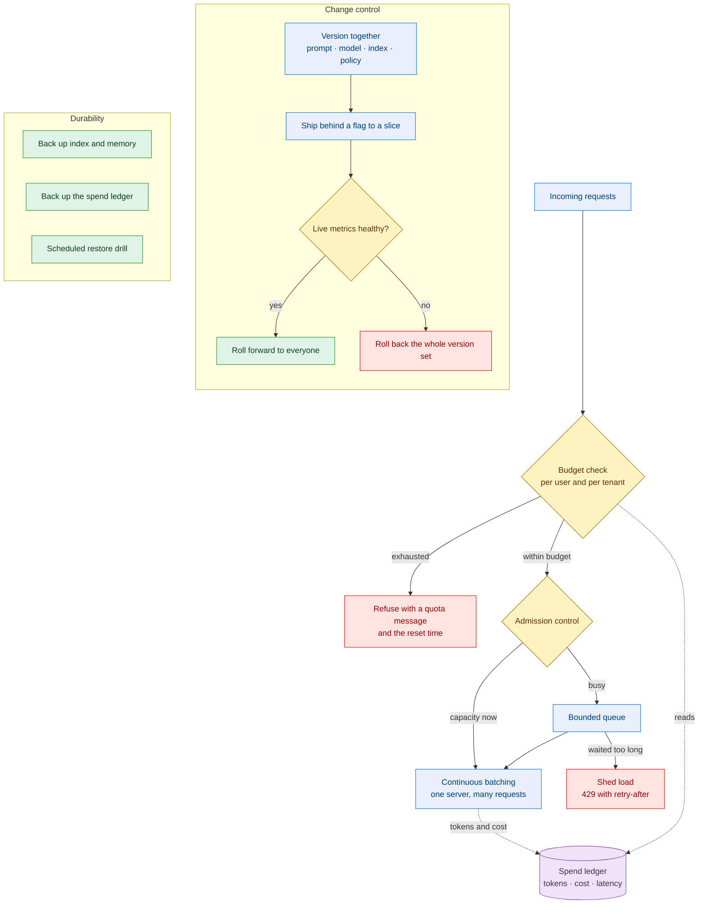
```mermaid
flowchart TB
    REQ["Incoming requests"]
    BUD{"Budget check<br/>per user and per tenant"}
    DENY["Refuse with a quota message<br/>and the reset time"]
    ADMIT{"Admission control"}
    QUEUE["Bounded queue"]
    SHED["Shed load<br/>429 with retry-after"]
    BATCH["Continuous batching<br/>one server, many requests"]
    SPEND[("Spend ledger<br/>tokens · cost · latency")]

    subgraph REL["Change control"]
        direction TB
        V1["Version together<br/>prompt · model · index · policy"]
        V2["Ship behind a flag to a slice"]
        V3{"Live metrics healthy?"}
        V4["Roll forward to everyone"]
        V5["Roll back the whole version set"]
    end

    subgraph DUR["Durability"]
        direction LR
        B1["Back up index and memory"]
        B2["Back up the spend ledger"]
        B3["Scheduled restore drill"]
    end

    REQ --> BUD
    BUD -->|exhausted| DENY
    BUD -->|within budget| ADMIT
    ADMIT -->|capacity now| BATCH
    ADMIT -->|busy| QUEUE
    QUEUE --> BATCH
    QUEUE -->|waited too long| SHED
    BATCH -.->|tokens and cost| SPEND
    BUD -.->|reads| SPEND

    V1 --> V2 --> V3
    V3 -->|yes| V4
    V3 -->|no| V5

    classDef flow fill:#e8f0fe,stroke:#0071e3,color:#003a70
    classDef decision fill:#fff3c2,stroke:#997404,color:#5c2e00
    classDef bad fill:#ffe4e2,stroke:#e30000,color:#8f0000
    classDef good fill:#dff3e6,stroke:#248a3d,color:#0f3d23
    classDef store fill:#efe3f9,stroke:#8944ab,color:#3f2c52

    class REQ,QUEUE,BATCH,V1,V2 flow
    class BUD,ADMIT,V3 decision
    class DENY,SHED,V5 bad
    class V4,B1,B2,B3 good
    class SPEND store
```

Operate the stack to written targets. Set SLOs on the numbers users feel, time to first token,
tokens per second, availability, and spend the error budget deliberately: a burn-rate alert on the
symptom pages someone, while a dashboard on the cause pages no one. Prometheus scrapes the numbers, Alertmanager routes the page, Grafana sits on top. Keep a one-page runbook for the
four failures behind most pages: model server out of memory (restart with a smaller max batch), KV
cache exhaustion (shed long-context requests first), a provider 429 storm (route to the fallback and
stop retrying), and a looping agent (the step budget from section 7 kills it; the alert tells you it
fired). For state, write RTO and RPO down before the incident: Postgres restore drills bound your
recovery time, and everything else in this stack rebuilds from config.

The error contract is part of the API. Map upstream failures to a small typed set (rate_limited,
overloaded, timeout, invalid_output, tool_failed) and give every hop a timeout smaller than its
caller's, so failures surface where they can be handled rather than where they happened. Retry
only idempotent calls, with exponential backoff plus jitter, capped by the turn budget. A circuit
breaker per provider stops retry storms; the fallback chain rides behind it. Tool calls that write
need idempotency keys so a retried call is applied once by a server that honours them. The user sees one honest sentence and a retry
control, never a stack trace; the trace carries the detail.

---

## 18. Identity, delegation and authority

Identity is easy to skip and expensive to retrofit. The retrieval filter (8), the cache key
(6, 12) and the tool allow-list (11) all enforce an entitlement scope; this layer is the decision
point that issues it.

The rule that makes the layer work is **attenuation**: authority shrinks at every delegation.
An agent must never hold more than the user who asked, and a tool call must never hold more than the
agent. Most agent breaches are not a model failure, they are an agent holding a broad, long-lived
credential and being talked into using it.

Concretely: OIDC / OAuth2 for human sign-in (Keycloak, Auth0, or your existing IdP), SPIFFE/SPIRE
for workload identity, and a policy engine such as OPA or Cedar as the decision point the tokens
flow from.

The token mechanics, named: delegated authority travels as short-lived JWTs whose `aud`, `exp` and
scope claims are checked at every enforcement point; attenuation is OAuth 2.0 token exchange
(RFC 8693), a broad token is traded for a narrower one, never the reverse; services authenticate to
each other with mTLS; and password handling belongs to your identity provider, not this stack, 
never store or hash user credentials yourself when an IdP can hold them.

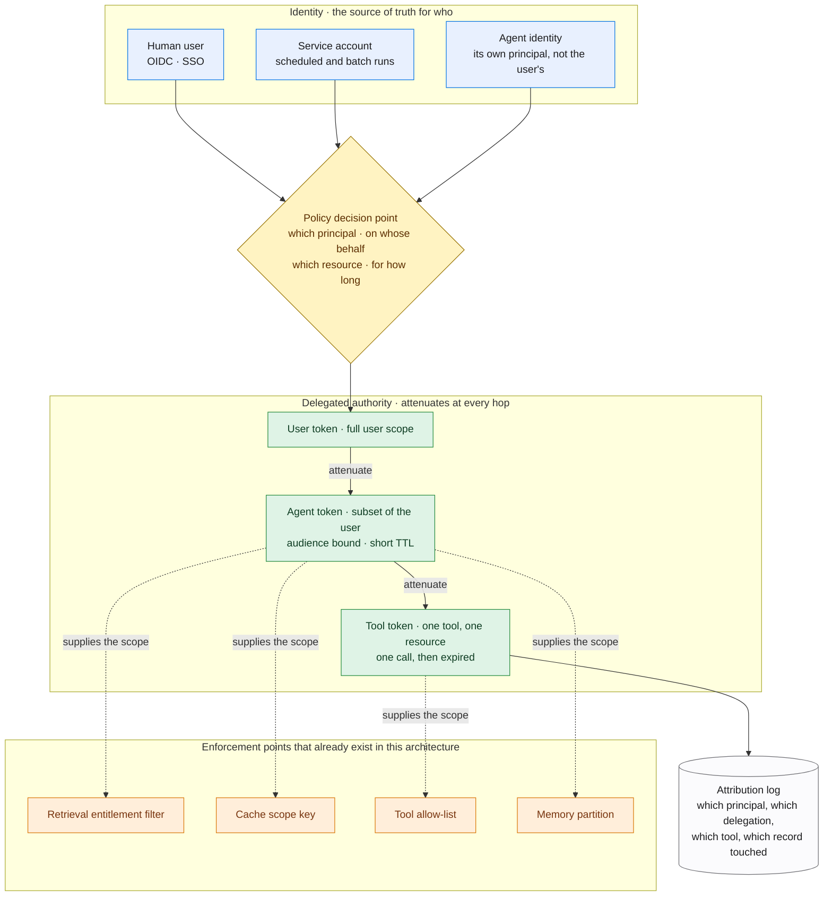
```mermaid
flowchart TB
    subgraph IDP["Identity · the source of truth for who"]
        direction LR
        U["Human user<br/>OIDC · SSO"]
        SVC["Service account<br/>scheduled and batch runs"]
        AG["Agent identity<br/>its own principal, not the user's"]
    end

    PDP{"Policy decision point<br/>which principal · on whose behalf<br/>which resource · for how long"}

    subgraph TOK["Delegated authority · attenuates at every hop"]
        direction TB
        T1["User token · full user scope"]
        T2["Agent token · subset of the user<br/>audience bound · short TTL"]
        T3["Tool token · one tool, one resource<br/>one call, then expired"]
    end

    subgraph PEPS["Enforcement points that already exist in this architecture"]
        direction LR
        E1["Retrieval entitlement filter"]
        E2["Cache scope key"]
        E3["Tool allow-list"]
        E4["Memory partition"]
    end

    AUDIT[("Attribution log<br/>which principal, which delegation,<br/>which tool, which record touched")]

    U --> PDP
    SVC --> PDP
    AG --> PDP
    PDP --> T1
    T1 -->|attenuate| T2
    T2 -->|attenuate| T3
    T2 -.->|supplies the scope| E1
    T2 -.->|supplies the scope| E2
    T3 -.->|supplies the scope| E3
    T2 -.->|supplies the scope| E4
    T3 --> AUDIT

    classDef id fill:#e8f0fe,stroke:#0071e3,color:#1d1d1f
    classDef decision fill:#fff3c2,stroke:#997404,color:#5c2e00
    classDef tok fill:#dff3e6,stroke:#248a3d,color:#0f3d23
    classDef pep fill:#ffeeda,stroke:#d97706,color:#78350f
    classDef store fill:#fbfbfd,stroke:#6e6e73,color:#1d1d1f

    class U,SVC,AG id
    class PDP decision
    class T1,T2,T3 tok
    class E1,E2,E3,E4 pep
    class AUDIT store
```

Give the agent its own identity rather than letting it borrow the user's. When it acts, the record
should show *user X, via agent Y, using tool Z*, not user X doing something they never typed.
Without that, you cannot investigate an incident and you cannot revoke the agent without revoking
the person.

---

## 19. Threat model

Security in an agent stack is not a single layer, it is a property every layer either has or lacks.
This matrix maps the ten risks in the OWASP Top 10 for Agentic Applications to the concrete control
this manual builds in, and to the section that carries it. Treat it as a checklist: a stack that
skips a row should know exactly why.

| ID | Threat | Control in this stack | Where |
|---|---|---|---|
| ASI01 | Agent Goal Hijack | Untrusted content is fenced and labelled; policy is restated after it; instructions found inside content are surfaced for review rather than followed | 10, 11 |
| ASI02 | Tool Misuse & Exploitation | Every call is schema-validated against an allow-list; side-effecting tools take attenuated single-resource tokens and idempotency keys | 11, 18 |
| ASI03 | Identity & Privilege Abuse | The agent is its own principal; authority attenuates at every delegation; every action is attributable as user to agent to tool | 18 |
| ASI04 | Agentic Supply Chain Vulnerabilities | MCP servers are pinned by version and digest; scopes reviewed at install; an update is a reviewed change, never an automatic pull | 19 |
| ASI05 | Unexpected Code Execution | Code execution runs in a container with no host mounts and no ambient credentials; egress is allow-listed; escape attempts are exercised in CI rather than assumed away | 11, 13 |
| ASI06 | Memory & Context Poisoning | Durable memory is written through a gate: provenance plus corroboration to promote, quarantine for the unverifiable, partitions per principal | 12, 19 |
| ASI07 | Insecure Inter-Agent Communication | Each agent thread carries its own identity; cross-agent messages are attributed and verified before a coordinator acts on them | 18 |
| ASI08 | Cascading Failures | Budgets per user and tenant, rework bounded at two cycles, side-effecting calls scoped to one resource, a bad call cannot fan out | 7, 17 |
| ASI09 | Human-Agent Trust Exploitation | Humans approve outbound artefacts, not intermediate steps; destructive actions always take a separate, explicit approval | 7 |
| ASI10 | Rogue Agents | A hard budget kill-switch, alarms on abnormal tool-call patterns, and a revocable agent principal, stopping the agent never means locking out the user | 17, 18 |

Two of these deserve their own drawing, because they are the two write paths an attacker reaches
first.

**Durable memory is an input, not a by-product.** Prompt injection lasts one turn; a poisoned memory
lasts until deleted. Anything promoted from conversation into long-term storage passes the same bar
as retrieved content: it carries provenance, it needs corroboration, and an unverifiable claim waits
in quarantine rather than becoming permanent.

**The tool layer is a supply chain.** Every MCP server is a dependency with full access to whatever
it is wired to, and `latest` means someone else decides what your agent can do tomorrow. Pin
versions and digests, review declared scopes when installing, and treat a server update exactly like
a code change.

**Cryptography in this stack is used, never invented.** TLS for everything in transit, mTLS between
services; encryption at rest through each store's native support; SHA-256 digests wherever an
artifact must be pinned or deduplicated, supply-chain pins, cache keys, idempotency keys; HMAC
signatures on every webhook you accept. The rule that outranks any algorithm list: use vetted
libraries and platform primitives, implementing cryptographic algorithms yourself is how stacks
acquire vulnerabilities, not security.

Secrets follow the same discipline. They live in a secrets manager, HashiCorp Vault, AWS Secrets
Manager, GCP Secret Manager, or SOPS-encrypted files in git for small stacks, reach processes as
environment injected at start, rotate on a schedule, and never appear in prompts, traces, or model
context. A credential the model can read is a credential the transcript now stores.

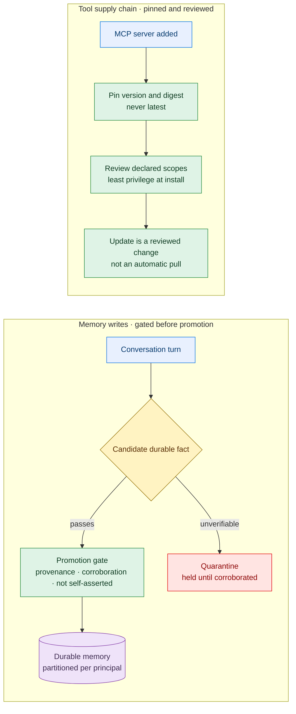
```mermaid
flowchart LR
    subgraph WRITE["Memory writes · gated before promotion"]
        direction TB
        W1["Conversation turn"]
        W2{"Candidate durable fact"}
        W3["Promotion gate<br/>provenance · corroboration · not self-asserted"]
        W4["Quarantine<br/>held until corroborated"]
        W5[("Durable memory<br/>partitioned per principal")]
    end

    subgraph SUP["Tool supply chain · pinned and reviewed"]
        direction TB
        S1["MCP server added"]
        S2["Pin version and digest<br/>never latest"]
        S3["Review declared scopes<br/>least privilege at install"]
        S4["Update is a reviewed change<br/>not an automatic pull"]
    end

    W1 --> W2
    W2 -->|passes| W3 --> W5
    W2 -->|unverifiable| W4
    S1 --> S2 --> S3 --> S4

    classDef flow fill:#e8f0fe,stroke:#0071e3,color:#003a70
    classDef decision fill:#fff3c2,stroke:#997404,color:#5c2e00
    classDef bad fill:#ffe4e2,stroke:#e30000,color:#8f0000
    classDef good fill:#dff3e6,stroke:#248a3d,color:#0f3d23
    classDef store fill:#efe3f9,stroke:#8944ab,color:#3f2c52

    class W1,S1 flow
    class W2 decision
    class W3,S2,S3,S4 good
    class W4 bad
    class W5 store
```

---

## 20. Latency budget

The performance view. Ranges below are indicative for a 7-32B model on one modern NVIDIA GPU at
batch 1: order-of-magnitude planning figures, not a benchmark. Measure your own, but the *shape*
holds: retrieval and guards are noise, and generation is everything.

The number that matters for an agent is not the turn, it is the turn multiplied by the loop. A
plan-act-observe cycle that runs eight model calls pays the prefill cost eight times, which is why
prefix reuse outranks almost every other optimisation here.

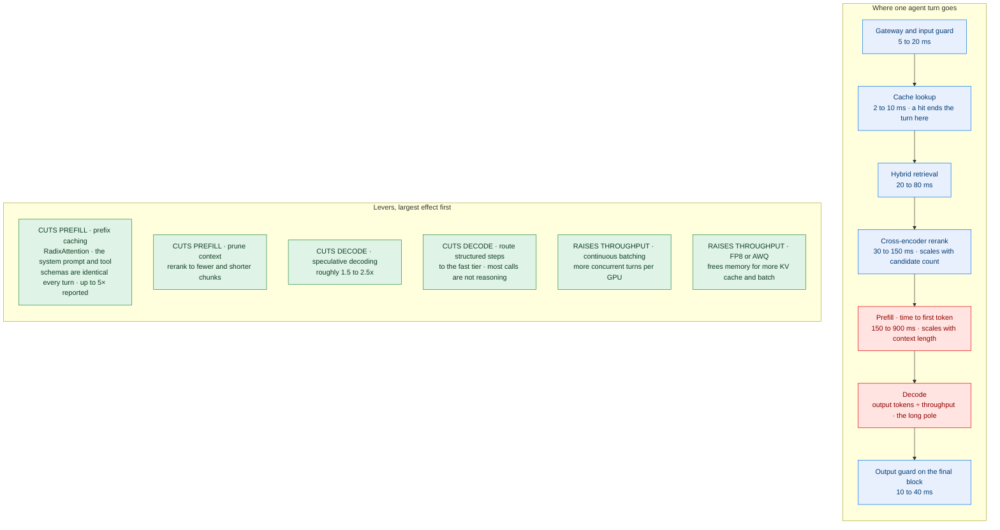
```mermaid
flowchart TB
    subgraph BUDGET["Where one agent turn goes"]
        direction TB
        L1["Gateway and input guard<br/>5 to 20 ms"]
        L2["Cache lookup<br/>2 to 10 ms · a hit ends the turn here"]
        L3["Hybrid retrieval<br/>20 to 80 ms"]
        L4["Cross-encoder rerank<br/>30 to 150 ms · scales with candidate count"]
        L5["Prefill · time to first token<br/>150 to 900 ms · scales with context length"]
        L6["Decode<br/>output tokens ÷ throughput · the long pole"]
        L7["Output guard on the final block<br/>10 to 40 ms"]
    end

    subgraph LEVERS["Levers, largest effect first"]
        direction TB
        V1["CUTS PREFILL · prefix caching<br/>RadixAttention · the system prompt and tool<br/>schemas are identical every turn · up to 5× reported"]
        V5["CUTS PREFILL · prune context<br/>rerank to fewer and shorter chunks"]
        V3["CUTS DECODE · speculative decoding<br/>roughly 1.5 to 2.5x"]
        V6["CUTS DECODE · route structured steps<br/>to the fast tier · most calls are not reasoning"]
        V2["RAISES THROUGHPUT · continuous batching<br/>more concurrent turns per GPU"]
        V4["RAISES THROUGHPUT · FP8 or AWQ<br/>frees memory for more KV cache and batch"]
    end

    L1 --> L2 --> L3 --> L4 --> L5 --> L6 --> L7

    classDef step fill:#e8f0fe,stroke:#0071e3,color:#003a70
    classDef hot fill:#ffe4e2,stroke:#e30000,color:#8f0000
    classDef lever fill:#dff3e6,stroke:#248a3d,color:#0f3d23

    class L1,L2,L3,L4,L7 step
    class L5,L6 hot
    class V1,V2,V3,V4,V5,V6 lever
```

Two measurements to separate, because they respond to different fixes. **Time to first token** is
prefill: compute-bound, driven by how much context you pushed in, fixed by pruning and prefix reuse.
**Time per output token** is decode: memory-bandwidth-bound, driven by model size and batch,
fixed by quantisation, speculation and a smaller model.

Optimise the wrong one and nothing moves. A user complaining the agent "feels slow" is almost always
describing time to first token; a user complaining it "takes forever" is describing decode.

---

Two of the levers above deserve their mechanics spelled out. PagedAttention, the idea behind vLLM,
allocates KV cache in fixed-size pages the way an operating system allocates virtual memory, so
sequences of different lengths pack tightly instead of fragmenting GPU memory; that packing is what
makes dense continuous batching possible at all. Speculative decoding attacks the sequential
bottleneck from the other side: a small draft model proposes several tokens, the large model
verifies the whole batch in one forward pass, and the acceptance rule keeps the output distribution
identical to the large model decoding alone. It pays most when decode is bandwidth-bound at low
batch sizes, and its gains shrink as batches grow, so measure before adopting it.

---

## 21. Technology catalogue

Every credible option per layer, so a swap is a known decision rather than a rewrite.

A star marks the recommended starting default, chosen on the stated criteria. Everything else in the group is a drop-in swap.

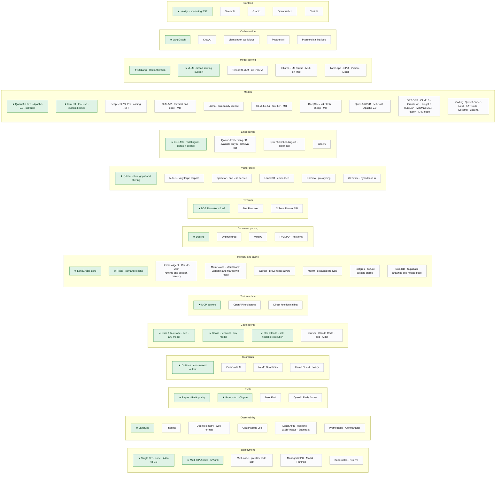
```mermaid
flowchart LR
    subgraph CAT_DP["Deployment"]
        DP1["★ Single GPU node · 24 to 48 GB"]
        DP2["★ Multi-GPU node · NVLink"]
        DP3["Multi-node · prefill/decode split"]
        DP4["Managed GPU · Modal · RunPod"]
        DP5["Kubernetes · KServe"]
    end
    subgraph CAT_OB["Observability"]
        OB1["★ Langfuse"]
        OB2["Phoenix"]
        OB3["OpenTelemetry · wire format"]
        OB4["Grafana plus Loki"]
        OB5["LangSmith · Helicone · W&B Weave · Braintrust"]
        OB6["Prometheus · Alertmanager"]
    end
    subgraph CAT_EV["Evals"]
        EV1["★ Ragas · RAG quality"]
        EV2["★ Promptfoo · CI gate"]
        EV3["DeepEval"]
        EV4["OpenAI Evals format"]
    end
    subgraph CAT_GR["Guardrails"]
        GR1["★ Outlines · constrained output"]
        GR2["Guardrails AI"]
        GR3["NeMo Guardrails"]
        GR4["Llama Guard · safety"]
    end
    subgraph CAT_CA["Code agents"]
        CA1["★ Cline / Kilo Code · free · any model"]
        CA2["★ Goose · terminal · any model"]
        CA3["★ OpenHands · self-hostable execution"]
        CA4["Cursor · Claude Code · Zed · Aider"]
    end
    subgraph CAT_TL["Tool interface"]
        TL1["★ MCP servers"]
        TL2["OpenAPI tool specs"]
        TL3["Direct function calling"]
    end
    subgraph CAT_ME["Memory and cache"]
        ME1["★ LangGraph store"]
        ME2["★ Redis · semantic cache"]
        ME3["Hermes Agent · Claude-Mem<br/>runtime and session memory"]
        ME4["MemPalace · MemSearch<br/>verbatim and Markdown recall"]
        ME5["GBrain · provenance-aware"]
        ME6["Mem0 · extracted lifecycle"]
        ME7["Postgres · SQLite<br/>durable stores"]
        ME8["DuckDB · Supabase<br/>analytics and hosted state"]
    end
    subgraph CAT_PA["Document parsing"]
        PA1["★ Docling"]
        PA2["Unstructured"]
        PA3["MinerU"]
        PA4["PyMuPDF · text only"]
    end
    subgraph CAT_RR["Reranker"]
        RR1["★ BGE Reranker v2 m3"]
        RR2["Jina Reranker"]
        RR3["Cohere Rerank API"]
    end
    subgraph CAT_VS["Vector store"]
        VS1["★ Qdrant · throughput and filtering"]
        VS2["Milvus · very large corpora"]
        VS3["pgvector · one less service"]
        VS4["LanceDB · embedded"]
        VS5["Chroma · prototyping"]
        VS6["Weaviate · hybrid built in"]
    end
    subgraph CAT_EM["Embeddings"]
        EM1["★ BGE-M3 · multilingual · dense + sparse"]
        EM2["Qwen3-Embedding-8B · evaluate on your retrieval set"]
        EM3["Qwen3-Embedding-4B · balanced"]
        EM4["Jina v5"]
    end
    subgraph CAT_MD["Models"]
        MD1["★ Qwen 3.6 27B · Apache-2.0 · self-host"]
        MD2["★ Kimi K3 · tool use · custom licence"]
        MD3["DeepSeek V4 Pro · coding · MIT"]
        MD4["GLM-5.2 · terminal and code · MIT"]
        MD5["Llama · community licence"]
        MD6["GLM-4.5-Air · fast tier · MIT"]
        MD7["DeepSeek V4 Flash · cheap · MIT"]
        MD8["Qwen 3.6 27B · self-host · Apache-2.0"]
        MD9["GPT-OSS · OLMo 3 · Granite 4.1 · Ling 3.0<br/>Hunyuan · MiniMax M2.x · Falcon · LFM edge"]
        MD10["Coding: Qwen3-Coder-Next · KAT-Coder<br/>Devstral · Laguna"]
    end
    subgraph CAT_SV["Model serving"]
        SV1["★ SGLang · RadixAttention"]
        SV2["★ vLLM · broad serving support"]
        SV3["TensorRT-LLM · all-NVIDIA"]
        SV4["Ollama · LM Studio · MLX on Mac"]
        SV5["llama.cpp · CPU · Vulkan · Metal"]
    end
    subgraph CAT_OR["Orchestration"]
        OR1["★ LangGraph"]
        OR2["CrewAI"]
        OR3["LlamaIndex Workflows"]
        OR4["Pydantic AI"]
        OR5["Plain tool calling loop"]
    end
    subgraph CAT_FE["Frontend"]
        FE1["★ Next.js · streaming SSE"]
        FE2["Streamlit"]
        FE3["Gradio"]
        FE4["Open WebUI"]
        FE5["Chainlit"]
    end

    classDef pick fill:#dff3e6,stroke:#248a3d,color:#0f3d23
    classDef alt fill:#fbfbfd,stroke:#a1a1a6,color:#1d1d1f

    class FE1,OR1,SV1,SV2,MD1,MD2,EM1,VS1,RR1,PA1,ME1,ME2,TL1,CA1,CA2,CA3,GR1,EV1,EV2,OB1,DP1,DP2 pick
    class FE2,FE3,FE4,FE5,OR2,OR3,OR4,OR5,SV3,SV4,SV5,MD3,MD4,MD5,MD6,MD7,MD8,MD9,MD10,EM2,EM3,EM4,VS2,VS3,VS4,VS5,VS6,RR2,RR3,PA2,PA3,PA4,ME3,ME4,ME5,ME6,ME7,ME8,TL2,TL3,CA4,GR2,GR3,GR4,EV3,EV4,OB2,OB3,OB4,OB5,OB6,DP3,DP4,DP5 alt
```

---

## 22. Task-to-model routing

The open-weight frontier moved to **trillion-scale MoE**, and that changes the architecture more than any benchmark does. Kimi K3 is 2.8T total parameters, DeepSeek V4 Pro 1.6T, GLM-5.2 753B. Qwen 3.8 Max is announced at 2.4T but has no published weights, which is its own lesson: announced is not downloadable. At 4-bit, K3 alone needs well over a terabyte of memory to hold.

**So "open-weight" no longer implies "self-hostable".** The line that matters is size, not licence: the frontier open models are consumed through an API exactly like the closed ones. Self-hosting is now the *mid-tier* story, DeepSeek V4 Flash (284B total, 13B active), gpt-oss-120b (117B total, 5.1B active, Apache-2.0), GLM-4.5-Air, Qwen 3.6 27B, where a single node is genuinely enough.

Read the positions below as indicative. Parameter counts and licences are sourced in section 27,
but where a model sits on either axis is an engineering judgement, not a measurement: capability
tiers are not a single published number, and whether something "fits one node" depends on the node.
What the figure is for is the scatter along the horizontal axis. MIT and Apache-2.0 models appear at
both extremes, which is the point: a permissive licence tells you what you may do with the weights,
never whether you can afford to run them.

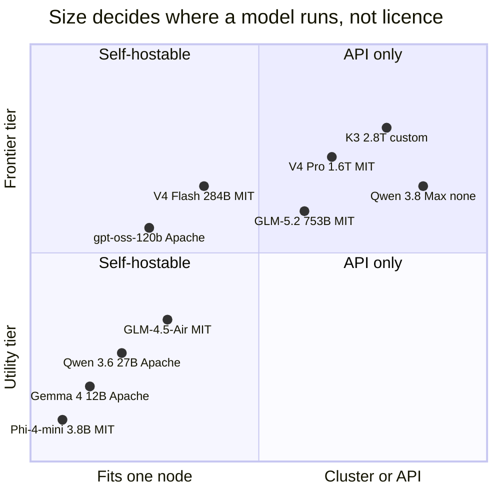
```mermaid
quadrantChart
    title Size decides where a model runs, not licence
    x-axis "Fits one node" --> "Cluster or API"
    y-axis "Utility tier" --> "Frontier tier"
    quadrant-1 "API only"
    quadrant-2 "Self-hostable"
    quadrant-3 "Self-hostable"
    quadrant-4 "API only"
    "K3 2.8T custom": [0.78, 0.80]
    "Qwen 3.8 Max none": [0.86, 0.66]
    "V4 Pro 1.6T MIT": [0.66, 0.73]
    "GLM-5.2 753B MIT": [0.60, 0.60]
    "V4 Flash 284B MIT": [0.38, 0.66]
    "gpt-oss-120b Apache": [0.26, 0.56]
    "GLM-4.5-Air MIT": [0.30, 0.34]
    "Qwen 3.6 27B Apache": [0.20, 0.26]
    "Gemma 4 12B Apache": [0.13, 0.18]
    "Phi-4-mini 3.8B MIT": [0.07, 0.10]
```

Route by task shape. Assume every row is measured on your own eval set before it ships. Vendors
refresh open models as dated checkpoints (DeepSeek's Flash-0731, for instance); production pins the
exact checkpoint ID, never the family name (section 25).

| Task | Open-weight | Frontier API | Notes |
|---|---|---|---|
| Extraction, classification, routing | GLM-4.5-Air · Qwen 3.5 9B · Phi-4-mini · Gemma 4 | Claude Haiku 4.5 | Constrained decoding matters more than model size. Self-host this tier. |
| General agentic + tool calling | Kimi K3 | Claude Sonnet 5 · Qwen 3.8 Max (API only) | K3 scores 57 on the Artificial Analysis Intelligence Index (60 in its max configuration); Kimi is explicitly tuned for tool loops. |
| Hard reasoning, long-horizon | DeepSeek V4 Pro | Claude Opus 5 | The tier where model choice actually shows up in output quality. |
| Coding and terminal work | DeepSeek V4 Pro · GLM-5.2 · Qwen3-Coder-Next | Claude Opus 5 | V4 Pro reports 79.4% SWE-bench Verified at its default Think High effort, 80.6% at maximum effort. GLM-5.2 strong on terminal-style benchmarks. |
| High-volume, cost-sensitive | DeepSeek V4 Flash | Claude Haiku 4.5 | Flash is 284B/13B active. Published rates are $0.14 in on a cache miss and $0.28 out per M tokens; the vendor has announced a significant increase. |
| Long context | Kimi K3 | Claude Opus 5 (1M) · Qwen 3.8 Max (API only) | All are 1M-class. Prefill cost still scales with what you actually send. |
| Vision, documents, charts | Qwen 3.5 27B (vision is native to the 3.5 line) | Claude Opus 5 · Qwen 3.8 Max (API only) | Give the model crop/zoom tools, cheaper than raising reasoning effort. |

### 22.1 The API layer: every way to call a model

One fact makes the whole stack swappable: **the OpenAI-compatible API is the lingua franca of
inference.** vLLM, SGLang, Ollama, llama.cpp and LM Studio all expose it locally, and most hosted
providers speak it too, so moving between self-hosted and hosted, or between hosts, is usually a
base-URL and key change, not a rewrite. Anthropic's Messages API is the main second dialect;
gateways such as LiteLLM and OpenRouter bridge the two.

| Category | Providers | Pick it for |
|---|---|---|
| Frontier first-party | Anthropic (Claude) · OpenAI · Google (Gemini) · xAI (Grok) · Mistral La Plateforme · DeepSeek API | Highest capability; each vendor's newest models first |
| Open-weight hosts | Groq · Cerebras · Together AI · Fireworks · DeepInfra · Replicate · Baseten · Hugging Face Inference | Open models without your own GPUs; Groq and Cerebras for extreme tokens-per-second |
| Routers and gateways | OpenRouter (one key, many providers) · LiteLLM (self-hosted proxy, one interface) | Provider failover, cost routing, one bill |
| Managed Kubernetes with accelerators | EKS + Trainium/Inferentia · GKE + TPU · AKS + ND-series GPUs | Bring the containerised stack, rent the silicon; the same compose services, scheduled |
| NVIDIA NIM | build.nvidia.com catalogue · prebuilt optimised containers | Hosted API to try, downloadable microservices to self-host on any NVIDIA hardware |
| Enterprise cloud endpoints | AWS Bedrock · Google Vertex AI · Microsoft Foundry · AWS SageMaker · Azure ML | Cloud-native IAM, billing, data residency, compliance paperwork |

Rule of thumb: prototype against a router, ship against one or two providers directly, and keep the
self-hosted mid-tier behind the same interface so any tier can answer any call.

### 22.2 Beyond text: speech and image I/O

Voice wraps the same agent in two extra hops: Whisper or faster-whisper transcribes speech in, and
an open TTS model speaks the reply out, Piper for speed on CPU, Kokoro for quality at 82M
parameters. The latency budget from section 20 absorbs both hops, which is why voice stacks stream
the first sentence of TTS while the rest is still generating; a voice turn feels broken after
roughly a second of silence. Vision input is already native in the open flagships (the vision row
above). Image generation is a separate model class, not an agent concern, FLUX or SDXL served
behind the same OpenAI-compatible pattern when a workflow needs it. Video generation is API-first
today (Runway, Kling, Sora), with LTX-Video as the open-weight entry point.

### 22.3 When to fine-tune: the open-weight advantage, used last

Owning the weights means you can change them, and that is a real advantage of this stack, used in
the right order. The ladder: **prompt first** (hours, reversible), **retrieve second** (days, keeps
knowledge current), **fine-tune last** (weeks, and you now own an artifact that must be versioned,
evaluated and re-trained). Fine-tune for *behaviour*, format discipline, tone, a task the model
does wrong the same way every time, never for *knowledge*, which belongs in retrieval where it can
be updated and deleted.

When you do tune: LoRA or QLoRA on a mid-tier model (7B-32B) covers almost every case at a fraction
of full-tuning cost. Tooling, Unsloth (fastest single-GPU path), Axolotl and LLaMA-Factory
(config-driven), Hugging Face PEFT and TRL (the underlying libraries); DPO for preference tuning.
Serving folds back into the stack you already have: vLLM and SGLang load LoRA adapters at runtime,
including several adapters on one base model, one deployment, many specialised behaviours.

**Pick two, not seven.** A fast tier and a frontier tier covers almost everything; every extra model is another prompt to tune, another eval set to maintain, and another cache that never warms. Add a third only when a measured gap justifies it.

---

## 23. Platform and SDK choice

Two independent questions decide this, and conflating them is the usual mistake:

1. **Who supplies the harness?** The agent loop, context management, tool dispatch.
2. **Who supplies the deployment?** The infrastructure it runs on.

Most SDKs answer only the first. Very few answer both.

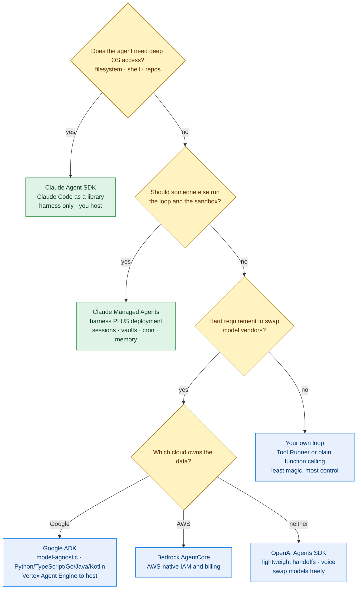
```mermaid
flowchart TB
    Q1{"Does the agent need deep OS access?<br/>filesystem · shell · repos"}
    Q1 -->|yes| CASDK["Claude Agent SDK<br/>Claude Code as a library<br/>harness only · you host"]
    Q1 -->|no| Q2{"Should someone else run<br/>the loop and the sandbox?"}

    Q2 -->|yes| CMA["Claude Managed Agents<br/>harness PLUS deployment<br/>sessions · vaults · cron · memory"]
    Q2 -->|no| Q3{"Hard requirement to swap<br/>model vendors?"}

    Q3 -->|yes| Q4{"Which cloud owns the data?"}
    Q3 -->|no| OWN["Your own loop<br/>Tool Runner or plain function calling<br/>least magic, most control"]

    Q4 -->|Google| ADK["Google ADK<br/>model-agnostic · Python/TypeScript/Go/Java/Kotlin<br/>Vertex Agent Engine to host"]
    Q4 -->|AWS| BR["Bedrock AgentCore<br/>AWS-native IAM and billing"]
    Q4 -->|neither| OAI["OpenAI Agents SDK<br/>lightweight handoffs · voice<br/>swap models freely"]

    classDef q fill:#fff3c2,stroke:#997404,color:#5c2e00
    classDef pick fill:#dff3e6,stroke:#248a3d,color:#0f3d23
    classDef alt fill:#e8f0fe,stroke:#0071e3,color:#003a70
    class Q1,Q2,Q3,Q4 q
    class CASDK,CMA pick
    class ADK,BR,OAI,OWN alt
```

| Option | Harness | Deployment | Strongest at |
|---|---|---|---|
| **Claude Agent SDK** | ✅ built-in tools, subagents, hooks | ❌ you host | Coding and filesystem agents; richest MCP ecosystem; on-prem friendly |
| **Claude Managed Agents** | ✅ | ✅ per-session sandbox | Scheduled work, long-running sessions, credential vaults, persistent memory |
| **OpenAI Agents SDK** | ✅ handoffs, guardrails | ❌ you host | Many lightweight agents; voice; free model swapping |
| **Google ADK** | ✅ | Vertex Agent Engine | GCP-native enterprise; multi-language; model-agnostic by design |
| **Bedrock AgentCore** | ✅ | AWS | AWS-native IAM, billing, and data residency |
| **Own loop** | ❌ you write it | ❌ you host | Full control; no framework to fight |

**Three things worth knowing before you commit.**

*Google ADK is model-agnostic, not Gemini-only*, it supports Gemini, Claude, Ollama, vLLM and LiteLLM out of the box, so choosing it does not lock your model choice. (There is no separate "Gemini ADK".)
Google ADK documents SDKs for Python, TypeScript, Go, Java, and Kotlin; confirm feature parity for the language and release you deploy.

*Bedrock and "Claude on AWS" are different products.* Bedrock is AWS-operated with a feature subset and `anthropic.`-prefixed model IDs. Claude Platform on AWS is Anthropic-operated with same-day feature parity and bare model IDs. Same cloud, different capability surface, check which one a tutorial means.

*Managed Agents is not available on Bedrock, Vertex, or Foundry.* If scheduled deployments, vaults, or session sandboxes are what you want, that decides your platform for you.

### 23.1 Build in your language

The stack does not force Python. Every layer has a serious option in each major ecosystem:

| Language | Orchestration and agents | Notes |
|---|---|---|
| Python | LangGraph · CrewAI · Pydantic AI · smolagents · LlamaIndex · Haystack · DSPy | The default; every serving engine and eval tool speaks it |
| TypeScript / JS | Mastra · Vercel AI SDK · LangGraph.js · OpenAI Agents SDK | Mastra for full agent apps; Vercel AI SDK for streaming UI and tool calls in Next.js; CopilotKit and assistant-ui for drop-in React chat components |
| Java / Kotlin | Google ADK · LangChain4j · Spring AI | The enterprise path; Spring AI rides existing Spring estates |
| C# / .NET | Microsoft Agent Framework (Semantic Kernel + AutoGen, merged) | First-class Azure integration |
| Go | Google ADK (Go) · plain tool loops | Infra services and high-concurrency backends |
| Rust | candle · mistral.rs | Performance-critical inference components |
| C / C++ | llama.cpp · ggml | The portable inference core everything else wraps |

Two more frameworks worth knowing regardless of language: **AWS Strands** (model-agnostic, tight
AgentCore and OpenTelemetry integration) and **Temporal** (durable execution when agent workflows
must survive restarts).

Version floors that matter in practice, taken from each project's own requirements:

| Runtime | Floor for this stack | Why |
|---|---|---|
| Python | 3.10 minimum | vLLM declares 3.10 to 3.14; SGLang declares 3.10 and up with no upper bound. 3.9 is below both |
| Node.js | 22 minimum, 24 preferred | Node 20 reached end of life on 30 April 2026. Node 24 is Active LTS; Node 22 is in maintenance until April 2027. the Vercel AI SDK pins `engines.node >=22` and Mastra pins `>=22.13.0` |
| TypeScript | No published floor | Neither Mastra nor the AI SDK declares a TypeScript minimum. They constrain Node instead. Match their toolchain if you need a number |
| Java | 17 | Spring AI and LangChain4j both set 17 in their parent POMs |
| CUDA | Driver 525 or newer for CUDA 12.x, 580 or newer for 13.x | Current PyTorch ships cu126 through cu132, spanning CUDA 12 and 13. Minor version compatibility means the driver needs the major-family minimum, not a match to the toolkit |
| ROCm | Match the PyTorch build to the ROCm release | Current PyTorch wheels track newer ROCm releases; ROCm 6.4 remains available for supported older PyTorch builds. Check the PyTorch selector and AMD matrix for the exact release pair |

### 23.2 Language pairs that ship

The seams between layers are protocols, not function calls, the OpenAI-compatible API for
inference, MCP for tools, A2A where agents from different vendors call each other, OTLP for traces. That makes the stack polyglot by default: any frontend
language can face any orchestrator language calling any serving stack. The one language-locked piece
is orchestrator state, framework checkpoints serialise in their own runtime, so choose the
orchestrator's language deliberately and let everything else differ.

Which pairing is most common, and which reaches production fastest, are indicative: no survey
measures either across this stack.

| Pair | Where it fits |
|---|---|
| TypeScript front end + Python orchestrator | The most common split: Next.js UI, LangGraph or CrewAI behind an API |
| All-TypeScript | Next.js + Mastra or Vercel AI SDK + hosted inference; one runtime, one deploy |
| All-Python | Streamlit or Gradio + LangGraph + vLLM/SGLang; the fastest lab-to-production path |
| Java / Kotlin + ADK or Spring AI | Agent features inside an existing enterprise estate |
| C# + Microsoft Agent Framework | .NET shops, Azure-native |
| Go services + Python ML edge | A high-concurrency backend calling a Python serving tier over the API |
| Rust / C++ inside serving only | candle, mistral.rs, llama.cpp underneath a higher-level stack |

Compatibility notes worth knowing before committing: tokenizers are model-specific, not
language-specific, count tokens with the model's own tokenizer whatever the client language; SDK
feature parity lags outside Python and TypeScript, so verify the specific feature you need
(streaming tool calls, structured output) in your language before designing around it; and MCP
servers are language-independent to call but mostly published as Node or Python processes to run.

### 23.3 Visual and low-code automation

A layer below code frameworks sits the visual automation stack, flowchart builders where each box
can be a model call, a tool, or a trigger. This is where operations teams and non-developers build
real automations, and where many production agent systems actually start.

| Tool | Licence / hosting | Best for |
|---|---|---|
| n8n | Fair-code, self-hostable | The default self-hosted automation hub; hundreds of integrations, LLM nodes |
| Dify | Open source | LLM app platform, RAG, agents and observability behind a UI |
| Flowise · Langflow | Open source | Visual LangChain-style flow builders |
| Activepieces | Open source | Open Zapier alternative |
| Zapier · Make | SaaS | Fastest path when self-hosting is not a requirement |

Graduate from boxes to a code framework when logic starts fighting the canvas, branching, retries
and evals are exactly the things 7 and 13 exist for.

### 23.4 Attaching to an existing web stack

If you already run MERN or MEAN (React or Angular over Express, Node, and MongoDB), Next.js, Django or FastAPI, Rails, Laravel, or Spring: the agent
stack is a **service beside your application, not a replacement for it**. Your backend calls the
gateway (5) over HTTP like any other service; your application database stays the system of record
(12). Two convenient overlaps, MongoDB teams get vector search in Atlas without adding a store, and
Postgres teams get the same from pgvector, so an existing stack often needs zero new databases to
adopt everything in this manual.

### 23.5 Where it runs in the cloud

| Category | Options | Pick it for |
|---|---|---|
| Hyperscaler GPU instances | AWS EC2 · Google Cloud · Azure · OCI | Existing cloud contracts, VPC integration |
| GPU clouds | CoreWeave · Lambda · RunPod · Vast.ai · Nebius | Cheaper per GPU-hour, faster access to new cards |
| Serverless GPU | Modal · Replicate · Baseten · RunPod Serverless | Per-request billing, scale-to-zero, no idle cost |
| Managed model endpoints | Bedrock · Vertex AI · Microsoft Foundry · HF Inference Endpoints | No serving ops at all; pay per token |

The trade is always the same: each row down means less operational burden and less control. Pick the
highest row your team can actually operate.

**The hybrid that actually ships:** frontier API for reasoning, self-hosted mid-tier for anything that must not leave your network, one router in front. The architecture in sections 1-16 does not change, only which endpoint the LLM layer points at.

---

## 24. Code agents: the full landscape

Layer 8 is the agent that writes code. There are dozens of options, in five distinct shapes, and the right pick depends far more on **where you work** and **what you're allowed to run** than on any benchmark.

**Pick by workflow first, model second.** Most of these are model-agnostic, you point them at whatever you already have, local or API. That matters more than a leaderboard position: an agent that fits your editor and your budget gets used, and one that doesn't, doesn't.

### 24.1 Terminal and CLI agents

| Tool | Licence / cost | Model-agnostic | Best for |
|---|---|---|---|
| **Aider** | Apache-2.0, free | ✅ any | Git-native pair programming, every edit is a commit. Check its repository activity and releases at evaluation time; maintenance status is time-sensitive |
| **Claude Code** | Subscription or API usage | Anthropic models | Terminal and IDE coding agent with subagent and tool workflows. Compare it on your own task and the specific benchmark you care about; rankings are benchmark- and date-dependent |
| **OpenCode** | Open source, free | ✅ any | Vendor-neutral terminal agent |
| **Gemini CLI** | Free tier available | Gemini | Generous free quota; good for exploration |
| **Codex CLI** | Included with eligible ChatGPT plans; usage limits vary | OpenAI | If you're already on OpenAI; verify plan limits and credit options before rollout |
| **Qwen Code** | Open source | Qwen | Pairs well with a self-hosted Qwen |
| **Crush · Forge · Plandex** | Open source | ✅ any | Plandex targets long, multi-file plans |

### 24.2 IDE extensions

| Tool | Licence / cost | Model-agnostic | Best for |
|---|---|---|---|
| **Cline** ★ | Open source, free | ✅ any | Plan/Act approval with permissioned file, terminal, browser, and MCP access. Verify current capabilities and maintenance status from its repository |
| **Roo Code** | Open source | ✅ any | **Shut down May 2026**, repository archived. Its README points users to Cline; ZooCode is a community fork |
| **Kilo Code** | Open source, free | ✅ any | Another Cline-lineage option |
| **Continue** | Apache-2.0 | ✅ any | **Read-only since 2026**, no longer actively maintained by declaration in its own README. The 2.0.0 release was final |
| **GitHub Copilot** | Plans and pricing vary | Multiple models, plan and surface dependent | Deep GitHub integration; choose from the models available to your plan and client |
| **Tabnine** | Free tier; paid teams | ✅ any, self-host | The air-gapped and on-prem option; fits open-weight deployments |
| **Qodo** | Free tier | ✅ any | Test generation and PR review agents |
| **Amazon Q Developer** | Free tier + paid | AWS | AWS-native shops |

### 24.3 Full IDEs

| Tool | Licence / cost | Best for |
|---|---|---|
| **Cursor** ★ | $20/mo Pro as of 13 August 2026; [cursor.com/pricing](https://cursor.com/pricing) | Best end-to-end IDE flow if you'll pay for one |
| **Windsurf** | Paid | **Rebranded to Devin Desktop** (Cognition); windsurf.com now redirects there. The JetBrains plugin remains separate |
| **Zed** | Free tier, open source | Fast native editor; free and model-agnostic |
| **Void** | Open source | Open-source Cursor alternative |
| **Trae** | Free | ByteDance's AI IDE; unusually generous free tier |
| **Kiro** | AWS | Spec-driven: writes requirements and design docs before code |
| **JetBrains Junie** | Paid | The JetBrains-native agent, inside IntelliJ and friends |

### 24.4 Autonomous and sandboxed agents

| Tool | Licence / cost | Best for |
|---|---|---|
| **OpenHands** ★ | Open source | A self-hostable agent with Docker-based execution; assess its autonomy, permissions, and sandbox configuration against your task |
| **SWE-agent** | Open source | Research lineage; benchmark-oriented |
| **Goose** | Open source (Linux Foundation) | Vendor-neutral governance; extensible |
| **Devin · Jules · Replit Agent** | Paid SaaS | Hosted, no local setup |

### 24.5 How to choose

| If you… | Use |
|---|---|
| Live in the terminal | **Goose** (free, vendor-neutral governance) or **Claude Code** (subscription/API-backed); evaluate both on your workflow |
| Use VS Code | **Cline** or **Kilo Code**: free, model-agnostic, approval-gated |
| Use JetBrains | **Kilo Code**, which ships a JetBrains build. Continue was the long-standing answer but is now read-only |
| Want an IDE that does it all and will pay | **Cursor** |
| Need fully autonomous, sandboxed runs | **OpenHands** |
| Cannot send code off-premises | **Cline / Kilo Code / Goose** pointed at your own served model |
| Have zero budget | **opencode · Cline · Kilo Code · Goose · Zed** are all free and model-agnostic |

### 24.6 Prompt-to-app builders

A separate category from code agents: these take a written description and produce a deployed
application, hosting included. Fastest possible path to an MVP; the trade is that a "cleanup and
architecture" phase arrives when the app needs to scale, at which point the rest of this manual is
what you graduate to.

| Tool | Made by | Best for |
|---|---|---|
| v0 | Vercel | Prompt-driven web applications and Next.js front ends; verify its current integrations and deployment posture for your stack |
| Lovable | Lovable | Full-stack apps with Supabase wiring built in |
| Bolt.new | StackBlitz | In-browser full-stack prototyping |
| Replit Agent | Replit | Hosted build-and-deploy in one place |
| Firebase Studio | Google | Prototype against Firebase services, free tier |

**The constraint that overrides all of the above:** if your code cannot leave the building, only the model-agnostic tools qualify, and you point them at the model you serve yourself from the "Start here" table. That single requirement eliminates most of the paid IDEs and is worth resolving before comparing anything else.

---

## 25. Versioning and change control

A release of an agent system pins five things, and rollback restores the tuple, not one element
(section 17): code, prompts and tool contracts, model IDs, index build, and config.

| What | Where it lives | Rule |
|---|---|---|
| Code | Git, trunk-based, short-lived branches, PR review | The only write path to production |
| Prompts and tool contracts | The same repo as code, one file per prompt, a changelog entry per edit | A prompt edit is a deploy; it rides the same eval gate as code |
| Model versions | A registry of immutable IDs (MLflow, W&B Artifacts, or a private Hugging Face hub) | Never "latest" in production; a silent model swap is an unevaluated release |
| Data and indexes | DVC or lakeFS for corpora; every index build stamped with embedder version and chunking config | An index rebuilt with a different embedder is a different index; version them together |
| Eval snapshots | Dataset hash plus scores, stored per release | The evidence a rollback decision reads |

One agent-specific twist is worth automating: when an agent writes code, the PR description
carries which model, prompt version and step budget produced it, so a bad patch traces back to
its configuration and not just its diff.

---

## 26. Build order and troubleshooting

The layers are not equally urgent. This order keeps the thing runnable at every step:

1. **Layers 2, 3, 6**: UI, a single-node orchestrator graph, and Ollama. You now have a chat app.
2. **The prompt contract**: output schema, citation rule and abstention path, with decoding
   parameters pinned. It costs an hour and every later eval depends on it being stable.
3. **Layer 11**: tracing before anything gets complicated. Debugging an agent without traces is guesswork.
4. **Layer 5**: RAG, with hybrid search and a reranker from the start rather than as a later fix.
   Entitlement filtering goes in on day one if more than one person will use it; retrofitting scope
   onto a live index is miserable.
5. **Layer 9**: checkpointer and semantic cache, which is where latency and cost improve most.
6. **Layer 7**: MCP tools, one server at a time, each behind schema validation, each result treated
   as untrusted on the way back in.
7. **Layer 10**: guards inline, then a golden dataset before the first prompt change you cannot verify by eye.
8. **Layer 8, then hardened serving**: the code agent, and section 17's admission control and
   rollback, last.
9. **Prefix caching before any hardware upgrade.** Section 20. Agent turns repeat the same system
   prompt and tool schemas; reusing that cache is the cheapest large win available.
10. **Identity before the second user.** Section 18. An agent borrowing a human's standing
   credentials is the single most common way these systems turn a prompt into a breach.
11. **Deletion and budgets**: sections 11 and 12. Both are cheap to add on day one and expensive to
   retrofit: a per-user token budget before the first shared deployment, and a delete path before the
   first real user's data enters the index.

Scale the review layers to the stakes. A single-team deployment does not need judge calibration or a
stratified gold set on day one, and adding them early is its own kind of failure. What does not scale down is
the trust boundary: the moment untrusted text reaches a tool that can write somewhere, sections 7 and
9 stop being optional regardless of project size.

### 26.1 When it breaks: the first-hour table

| Symptom | Usual cause | Fix |
|---|---|---|
| Server OOMs at model load | Context length or quant too big for VRAM | Lower max-model-len, drop to 4-bit, or quantize the KV cache |
| Output is garbage tokens | Wrong chat template | Set the model's template explicitly; never trust autodetect silently |
| First token takes seconds | Cold weights, no prefix cache | Warm up at boot with a dummy request; enable prefix caching |
| Throughput collapses under load | No admission control, batch thrash | Queue at the gateway (section 17); cap concurrency at what the batch sustains |
| Tool calls come back empty or malformed | Schema drift between contract and prompt | Validate against the JSON Schema; regenerate once with the error in context |
| RAG cites the wrong passages | Chunking or embedder changed after indexing | Re-embed the corpus; embedder and index version together (section 25) |
| Same input, different CI results | Sampling nondeterminism | Temperature 0 and pinned seeds; judged metrics take the median of three runs |
| Agent loops without finishing | No step budget enforced | The section 7 budget kills it; alert when it fires |
| 429 storms from a provider | Retries without backoff amplifying load | Backoff plus jitter, a circuit breaker, then the fallback chain (section 17) |
| Blank page with JavaScript on | UI hides content before a scripted reveal | Content visible by default; motion is an enhancement (section 6) |

---

## 27. Sources and verification

This section records primary sources for the model, runtime, version-floor, and tool claims that are
most likely to change. Link and generated-artifact checks run in CI; the freshness workflow monitors a
tracked set of volatile model and tool claims, rather than proving that every sentence or external page
remains current. Model facts age fastest: re-verify the sections 21 and 22 rows against their cards
before relying on them months from now.

**Last verified:** 13 August 2026. Hugging Face licence tags for the named 27.1 checkpoints were
re-read that day. Parameter counts below are as those cards stated then. Vendor list prices move;
where a former pricing URL no longer publishes a rate card, the row says so.

### 27.1 Models and licences

| Model | Verified fact | Primary source |
|---|---|---|
| Kimi K3 | 2.8T total / 104B active MoE · 1M context · custom Kimi K3 License (card tag `other`, `license_name` kimi-k3) | [Model card](https://huggingface.co/moonshotai/Kimi-K3) |
| Qwen 3.8 Max | Announced with 2.4T total / 95B active and ~1M context, but no downloadable weights are published under the Qwen organisation. Treat as an API model | [Qwen blog](https://qwen.ai/blog?id=qwen3.8) |
| DeepSeek V4 Pro | 1.6T / 49B active · MIT · SWE-bench Verified 79.4 at Think High, 80.6 at Think Max, per the card's own mode comparison | [Model card](https://huggingface.co/deepseek-ai/DeepSeek-V4-Pro) |
| DeepSeek V4 Flash | 284B / 13B active · MIT · API list price is vendor-published and changes. The former docs URL `api-docs.deepseek.com/quick_start/pricing` now opens the first-API-call guide, not a rate card; re-check DeepSeek's current pricing page before budgeting | [Model card](https://huggingface.co/deepseek-ai/DeepSeek-V4-Flash) · [API docs](https://api-docs.deepseek.com/) |
| GLM-5.2 | 753B · MIT · 1M context | [Model card](https://huggingface.co/zai-org/GLM-5.2) |
| GLM-4.5-Air | Fast tier · MIT | [Model card](https://huggingface.co/zai-org/GLM-4.5-Air) |
| Qwen 3.6 27B / 3.5 9B | Apache-2.0 | [Qwen3.6-27B](https://huggingface.co/Qwen/Qwen3.6-27B) · [Qwen3.5-9B](https://huggingface.co/Qwen/Qwen3.5-9B) |
| Qwen 2 / 2.5 licence examples | Qwen2.5-7B, 14B, 32B, and Coder-32B cards are Apache-2.0; other named checkpoints must be checked individually | [7B](https://huggingface.co/Qwen/Qwen2.5-7B-Instruct) · [14B](https://huggingface.co/Qwen/Qwen2.5-14B-Instruct) · [32B](https://huggingface.co/Qwen/Qwen2.5-32B-Instruct) · [Coder-32B](https://huggingface.co/Qwen/Qwen2.5-Coder-32B-Instruct) |
| gpt-oss-120b / 20b | OpenAI's open-weight MoE pair · Apache-2.0 · card states 117B total / 5.1B active for 120b | [Model card](https://huggingface.co/openai/gpt-oss-120b) |
| Gemma 4 | 12B instruction-tuned entry of the Apache-2.0 generation | [Model card](https://huggingface.co/google/gemma-4-12B-it) |
| OLMo 3 | Fully open (weights, data, code) · Apache-2.0 | [Model card](https://huggingface.co/allenai/Olmo-3-1025-7B) |
| Granite 4.1 | IBM's enterprise family · Apache-2.0 | [Model card](https://huggingface.co/ibm-granite/granite-4.1-30b) |
| Ling 3.0 flash | Ant Group MoE · MIT | [Model card](https://huggingface.co/inclusionAI/Ling-3.0-flash) |
| Hunyuan Hy3 | Tencent · Apache-2.0 | [Model card](https://huggingface.co/tencent/Hy3) |
| MiniMax M2.7 | Non-commercial. Commercial use requires prior written authorisation, stated in the repository licence file rather than the card tag | [Model card](https://huggingface.co/MiniMaxAI/MiniMax-M2.7) · [Licence](https://github.com/MiniMax-AI/MiniMax-M2.7/blob/main/LICENSE) |
| LFM2.5 (edge) | Liquid AI's edge family · LFM Open Licence (card tag `other`, `license_name` lfm1.0) | [Model card](https://huggingface.co/LiquidAI/LFM2.5-2.6B) |
| Qwen3-Coder-Next | Open coding specialist · Apache-2.0 | [Model card](https://huggingface.co/Qwen/Qwen3-Coder-Next) |
| KAT-Coder V2.5 | Agentic coding MoE · Apache-2.0 | [Model card](https://huggingface.co/Kwaipilot/KAT-Coder-V2.5-Dev) |
| Devstral Small 2 | Mistral's open coding model · Apache-2.0 | [Model card](https://huggingface.co/mistralai/Devstral-Small-2-24B-Instruct-2512) |
| Laguna S 2.1 | poolside's coding model · OpenMDW licence | [Model card](https://huggingface.co/poolside/Laguna-S-2.1) |
| NVFP4 checkpoints | NVIDIA's prequantised open flagships | [huggingface.co/nvidia](https://huggingface.co/nvidia) |
| Llama | Llama 4 Community License, custom, not on the OSI-approved list | [Licence](https://github.com/meta-llama/llama-models/blob/main/models/llama4/LICENSE) |
| Gemma | Gemma Terms of Use for older versions; Gemma 4 under Apache-2.0 | [Model card](https://huggingface.co/google/gemma-4-12B-it) · [Terms](https://ai.google.dev/gemma/terms) |
| Phi-4 / Phi-4-mini | MIT · 14B / 3.8B | [Model card](https://huggingface.co/microsoft/phi-4) |
| Kokoro | 82M parameters · Apache-2.0 | [Model card](https://huggingface.co/hexgrad/Kokoro-82M) |
| BGE-M3 | Dense + sparse + multi-vector in one model · 100+ languages · MIT | [Model card](https://huggingface.co/BAAI/bge-m3) |
| LTX-Video | Open-weight video generation (Lightricks) | [Model card](https://huggingface.co/Lightricks/LTX-Video) |

### 27.2 Serving, runtimes and hardware

| Claim in this manual | What the source says | Primary source |
|---|---|---|
| vLLM supports quantized inference with AWQ, GPTQ/GPTQModel, and FP8 W8A8 | The supported-format list names AutoAWQ, GPTQModel, and FP8 W8A8; its hardware matrix lists AWQ, GPTQ, and llm-compressor FP8 W8A8 | [vLLM source docs](https://github.com/vllm-project/vllm/blob/b2506d62aec7e6bccc5959b829221a7ae217abf3/docs/features/quantization/README.md#L8-L57) |
| SGLang prefix caching pays for agents | Official figures: up to 5× throughput (blog), up to 6.4× (paper) | [LMSYS blog](https://lmsys.org/blog/2024-01-17-sglang/) · [Paper](https://arxiv.org/abs/2312.07104) |
| FP8 needs Ada, Hopper or newer | TensorRT-LLM support matrix lists FP8 on SM89/SM90, not Ampere | [Support matrix](https://nvidia.github.io/TensorRT-LLM/reference/support-matrix.html) |
| llama.cpp spans CPU, Metal, CUDA, Vulkan via GGUF | README backend table; GGUF conversion ships in-repo | [Repo](https://github.com/ggml-org/llama.cpp) |
| MLX beats llama.cpp under 14B on Apple Silicon | Published comparison: 20-87% higher generation throughput, gap near zero at 27B+ | [Benchmark](https://groundy.com/articles/mlx-vs-llamacpp-on-apple-silicon-which-runtime-to-use-for-local-llm-inference/) · [arXiv study](https://arxiv.org/abs/2511.05502) |
| ROCm on Windows covers only select new hardware | Compatibility matrix: native Windows 11 for Radeon AI PRO R9000 and Ryzen AI Max PRO 400, plus WSL2 | [ROCm matrix](https://rocm.docs.amd.com/en/latest/compatibility/compatibility-matrix.html) |
| The OpenAI-compatible API is the serving lingua franca | vLLM documents its OpenAI-compatible server (/v1/chat/completions and friends) | [vLLM source docs](https://github.com/vllm-project/vllm/blob/b2506d62aec7e6bccc5959b829221a7ae217abf3/docs/serving/online_serving/openai_compatible_server.md#L1-L24) |
| PagedAttention ends KV fragmentation | Paged, virtual-memory-style KV allocation; the mechanism behind vLLM's batching density | [Paper](https://arxiv.org/abs/2309.06180) |
| Speculative decoding preserves output quality | Draft-and-verify decoding with an acceptance rule that keeps the target model's distribution | [Paper](https://arxiv.org/abs/2211.17192) |
| NVIDIA NIM catalogue | Hosted trials and downloadable optimised inference containers | [build.nvidia.com](https://build.nvidia.com/models) |
| DGX Spark | GB10, 128 GB unified memory desktop | [nvidia.com](https://www.nvidia.com/en-us/products/workstations/dgx-spark/) |
| Jetson modules | Edge inference hardware | [developer.nvidia.com](https://developer.nvidia.com/embedded/jetson-modules) |
| Cloud accelerators | TPU (GCP) and Trainium (AWS) product pages | [cloud.google.com/tpu](https://cloud.google.com/tpu) · [aws.amazon.com](https://aws.amazon.com/ai/machine-learning/trainium/) |

### 27.3 Standards, protocols and benchmarks

| Reference | Source |
|---|---|
| OWASP Top 10 for Agentic Applications for 2026 (ASI01-ASI10) | [genai.owasp.org](https://genai.owasp.org/resource/owasp-top-10-for-agentic-applications-for-2026/) |
| RFC 8693, OAuth 2.0 Token Exchange | [rfc-editor.org](https://www.rfc-editor.org/rfc/rfc8693) |
| OpenID Connect Core 1.0 | [openid.net](https://openid.net/specs/openid-connect-core-1_0.html) |
| SPIFFE workload identity | [spiffe.io](https://spiffe.io/) |
| Open Policy Agent | [openpolicyagent.org](https://www.openpolicyagent.org/) |
| Cedar policy language | [GitHub](https://github.com/cedar-policy/cedar) |
| Model Context Protocol | [modelcontextprotocol.io](https://modelcontextprotocol.io/) |
| A2A protocol (Linux Foundation) | [a2a-protocol.org](https://a2a-protocol.org/latest/) |
| OpenTelemetry / OTLP | [opentelemetry.io](https://opentelemetry.io/) |
| SWE-bench leaderboards | [swebench.com](https://www.swebench.com/) |
| MTEB embedding leaderboard | [Hugging Face](https://huggingface.co/spaces/mteb/leaderboard) |
| LiveCodeBench | [livecodebench.github.io](https://livecodebench.github.io/) |
| Artificial Analysis Intelligence Index, Kimi K3: 57, max config 60 | [artificialanalysis.ai](https://artificialanalysis.ai/models/kimi-k3) |

### 27.4 Runtimes and version floors

| Claim in this manual | Primary source |
|---|---|
| Node 20 reached end of life 30 April 2026; Node 24 is Active LTS and 22 is in maintenance | [nodejs/Release schedule](https://github.com/nodejs/Release/blob/main/schedule.json) |
| vLLM declares Python 3.10 to 3.14 | [vLLM pyproject](https://github.com/vllm-project/vllm/blob/main/pyproject.toml) |
| SGLang declares Python 3.10 and up with no upper bound | [SGLang pyproject](https://github.com/sgl-project/sglang/blob/main/python/pyproject.toml) |
| PyTorch publishes current and previous ROCm wheels; compatibility depends on the selected torch release | [PyTorch install selector](https://pytorch.org/get-started/locally/) · [previous versions](https://docs.pytorch.org/get-started/previous-versions/) |
| CUDA minor version compatibility sets the driver floor by major family | [CUDA release notes](https://docs.nvidia.com/cuda/cuda-toolkit-release-notes/index.html) |
| Spring AI and LangChain4j both set Java 17 | [Spring AI pom](https://github.com/spring-projects/spring-ai/blob/main/pom.xml) · [LangChain4j pom](https://github.com/langchain4j/langchain4j/blob/main/langchain4j-parent/pom.xml) |

### 27.5 Code agents

Maintenance status is volatile. Every entry below links the project's own repository or site, which is the only place the current state is authoritative.

| Tool | Source |
|---|---|
| Cline | [github.com/cline/cline](https://github.com/cline/cline) |
| Kilo Code | [github.com/Kilo-Org/kilocode](https://github.com/Kilo-Org/kilocode) |
| Roo Code (shut down May 2026, archived) | [github.com/RooCodeInc/Roo-Code](https://github.com/RooCodeInc/Roo-Code) |
| Continue (read-only) | [github.com/continuedev/continue](https://github.com/continuedev/continue) |
| Aider (dormant) | [github.com/Aider-AI/aider](https://github.com/Aider-AI/aider) |
| OpenHands | [github.com/OpenHands/OpenHands](https://github.com/OpenHands/OpenHands) |
| Goose | [github.com/aaif-goose/goose](https://github.com/aaif-goose/goose) |
| Cursor | [cursor.com](https://cursor.com/) |
| Zed | [github.com/zed-industries/zed](https://github.com/zed-industries/zed) |
| Tabnine | [tabnine.com](https://www.tabnine.com/) |
| Qodo | [qodo.ai](https://www.qodo.ai/) |
| Codex CLI | [github.com/openai/codex](https://github.com/openai/codex) |
| Codex plan availability | [OpenAI Codex pricing](https://developers.openai.com/codex/pricing) |
| Gemini CLI | [github.com/google-gemini/gemini-cli](https://github.com/google-gemini/gemini-cli) |
| GitHub Copilot model availability | [GitHub Docs](https://docs.github.com/en/copilot/reference/ai-models/supported-models) |
| Devin, and Devin Desktop (formerly Windsurf) | [devin.ai](https://devin.ai/) |
| Jules | [jules.google](https://jules.google/) |
| v0 | [v0.dev](https://v0.dev/) |

Pricing figures quoted in section 24 are `indicative`: vendors change them without notice, and this
manual does not re-check them on a schedule. Cursor Pro was $20/mo on [cursor.com/pricing](https://cursor.com/pricing)
on 13 August 2026.

### 27.6 Libraries by layer

Every link below resolves to the project's official home.

| Layer | Verified links |
|---|---|
| Serving and runtimes | [vLLM](https://github.com/vllm-project/vllm) · [SGLang](https://github.com/sgl-project/sglang) · [llama.cpp](https://github.com/ggml-org/llama.cpp) · [TensorRT-LLM](https://github.com/NVIDIA/TensorRT-LLM) · [MLX](https://github.com/ml-explore/mlx) · [mlx-community](https://huggingface.co/mlx-community) · [Ollama](https://github.com/ollama/ollama) · [LM Studio](https://lmstudio.ai) · [Ray](https://github.com/ray-project/ray) · [Weaviate](https://github.com/weaviate/weaviate) · [Haystack](https://github.com/deepset-ai/haystack) · [LangSmith](https://www.langchain.com/langsmith) |
| Orchestration and SDKs | [Mastra](https://github.com/mastra-ai/mastra) · [LangGraph](https://github.com/langchain-ai/langgraph) · [CrewAI](https://github.com/crewAIInc/crewAI) · [Pydantic AI](https://github.com/pydantic/pydantic-ai) · [Vercel AI SDK](https://github.com/vercel/ai) · [OpenAI Agents SDK](https://github.com/openai/openai-agents-python) · [Google ADK language support](https://adk.dev/get-started/installation/) · [Microsoft Agent Framework](https://github.com/microsoft/agent-framework) · [AWS Strands](https://github.com/strands-agents/sdk-python) · [smolagents](https://github.com/huggingface/smolagents) · [LangChain4j](https://github.com/langchain4j/langchain4j) · [Spring AI](https://github.com/spring-projects/spring-ai) · [Temporal](https://github.com/temporalio/temporal) |
| Retrieval and data | [Qdrant](https://github.com/qdrant/qdrant) · [Milvus](https://github.com/milvus-io/milvus) · [pgvector](https://github.com/pgvector/pgvector) · [LanceDB](https://github.com/lancedb/lancedb) · [Chroma](https://github.com/chroma-core/chroma) · [BGE-M3](https://huggingface.co/BAAI/bge-m3) · [Docling](https://github.com/docling-project/docling) · [Unstructured](https://github.com/Unstructured-IO/unstructured) · [RAGFlow](https://github.com/infiniflow/ragflow) · [Airflow](https://github.com/apache/airflow) · [Prefect](https://github.com/PrefectHQ/prefect) · [Dagster](https://github.com/dagster-io/dagster) |
| Evals, guardrails, observability | [Ragas](https://github.com/explodinggradients/ragas) · [Promptfoo](https://github.com/promptfoo/promptfoo) · [DeepEval](https://github.com/confident-ai/deepeval) · [Langfuse](https://github.com/langfuse/langfuse) · [Phoenix](https://github.com/Arize-ai/phoenix) · [Outlines](https://github.com/dottxt-ai/outlines) · [Guardrails AI](https://github.com/guardrails-ai/guardrails) · [NeMo Guardrails](https://github.com/NVIDIA/NeMo-Guardrails) |
| Fine-tuning | [Unsloth](https://github.com/unslothai/unsloth) · [Axolotl](https://github.com/axolotl-ai-cloud/axolotl) · [LLaMA-Factory](https://github.com/hiyouga/LLaMA-Factory) · [PEFT](https://github.com/huggingface/peft) · [TRL](https://github.com/huggingface/trl) |
| Speech, media, sandboxing | [Whisper](https://github.com/openai/whisper) · [faster-whisper](https://github.com/SYSTRAN/faster-whisper) · [Piper](https://github.com/OHF-Voice/piper1-gpl) · [Kokoro](https://github.com/hexgrad/kokoro) · [FLUX](https://huggingface.co/black-forest-labs) · [LiteLLM](https://github.com/BerriAI/litellm) · [OpenRouter](https://openrouter.ai) · [E2B](https://github.com/e2b-dev/e2b) · [Modal](https://modal.com) · [gVisor](https://gvisor.dev) · [Firecracker](https://firecracker-microvm.github.io) · [CopilotKit](https://github.com/CopilotKit/CopilotKit) · [assistant-ui](https://github.com/assistant-ui/assistant-ui) |

### 27.7 Deployment memory catalogue

| System | Primary source |
|---|---|
| Hermes Agent memory and providers | [memory](https://hermes-agent.nousresearch.com/docs/user-guide/features/memory) · [providers](https://hermes-agent.nousresearch.com/docs/user-guide/features/memory-providers) |
| Claude-Mem architecture and telemetry | [repository](https://github.com/thedotmack/claude-mem) · [architecture](https://docs.claude-mem.ai/architecture/overview) · [telemetry](https://docs.claude-mem.ai/telemetry) |
| MemPalace | [github.com/MemPalace/mempalace](https://github.com/MemPalace/mempalace) |
| GBrain protocol | [repository](https://github.com/garrytan/gbrain) · [MEMORY_VERBS_v1](https://github.com/garrytan/gbrain/blob/master/docs/protocol/MEMORY_VERBS_v1.md) |
| MemSearch architecture | [repository](https://github.com/zilliztech/memsearch) · [architecture](https://zilliztech.github.io/memsearch/architecture/) |
| Mem0 add and expiration lifecycle | [repository](https://github.com/mem0ai/mem0) · [add](https://docs.mem0.ai/core-concepts/memory-operations/add) · [expiration](https://docs.mem0.ai/platform/features/memory-expiration) |
