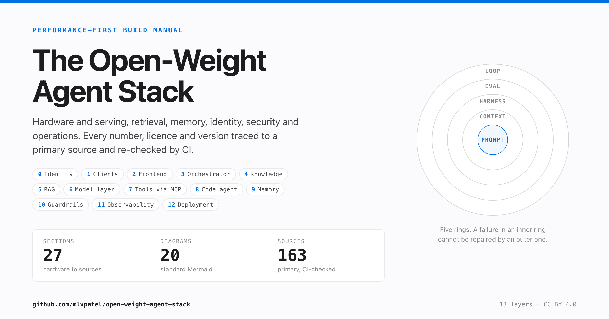
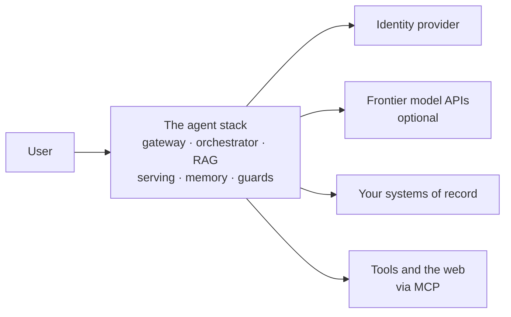

<div align="center">



# The Open-Weight Agent Stack

**A performance-first build manual for agentic AI on open-weight models.**

Hardware and serving, retrieval, memory, identity, security, and operations.
27 sections and 20 reusable diagrams, with model, licence, and benchmark claims traced to primary sources.

[](https://github.com/mlvpatel/open-weight-agent-stack/actions/workflows/validate.yml)
[](https://github.com/mlvpatel/open-weight-agent-stack/actions/workflows/freshness.yml)
[](https://github.com/mlvpatel/open-weight-agent-stack/actions/workflows/codeql.yml)
[](https://github.com/mlvpatel/open-weight-agent-stack/releases/latest)
[](LICENSE)
[](CONTRIBUTING.md)

**[Read the manual](MANUAL.md)** &nbsp;·&nbsp; **[Live site](https://mlvpatel.github.io/open-weight-agent-stack/)** &nbsp;·&nbsp; **[Architecture in C4](docs/ARCHITECTURE.md)** &nbsp;·&nbsp; **[Model licences](docs/MODELS.md)** &nbsp;·&nbsp; **[What CI proves](docs/VERIFICATION.md)**

<br>

### What the manual covers

Every category below leads with more than one option, and at least one you can run yourself. Nothing here is an unmarked default.

**Serving and runtimes** &nbsp;·&nbsp; layer 6


**Open-weight models and providers** &nbsp;·&nbsp; [per-model licences](docs/MODELS.md)


**Retrieval, memory and state** &nbsp;·&nbsp; layers 5, 9


**Orchestration and tools** &nbsp;·&nbsp; layers 3, 7


**Operations** &nbsp;·&nbsp; layers 11, 12


**This repository is built with**


</div>

## What this is

The complete blueprint for building agentic AI on open-weight models: choosing hardware and serving it fast, grounding answers in your own data, guarding every input, and operating the loop in production. Latency and throughput are the ruling metrics, because an agent loop multiplies every millisecond it spends.



The full four-level breakdown lives in [docs/ARCHITECTURE.md](docs/ARCHITECTURE.md).

### Who this is for, and what it is not

It is written for the engineer who has to decide what to run, on what hardware, with which model, and how to operate it without being the only person who understands it. It assumes you can read a system diagram and would rather see the tradeoff than the recommendation.

It is not a tutorial, and it does not benchmark models for you. Every routing table says to measure on your own eval set before shipping, because a benchmark that did not run on your data is someone else's result. Where a number has no published source, it is marked `indicative` rather than dressed up as a measurement.

Three things follow from that, and they are the reason to read this rather than a blog post:

- **Licences are stated per model, never per family.** Most families are not internally consistent: the same organisation ships Apache-2.0, custom, and non-commercial terms side by side, and a family-level claim is legal guidance by implication. [docs/MODELS.md](docs/MODELS.md) splits them.
- **Open weight no longer implies self-hostable.** The frontier open models are trillion-scale and consumed through an API exactly like the closed ones. The line that decides where a model runs is size, not licence, and [section 22](MANUAL.md#22-task-to-model-routing) plots it.
- **The security chapter maps to a published standard**, the OWASP Top 10 for Agentic Applications, using the official risk names rather than paraphrases.

## How to explore this repository

Four different people arrive here wanting four different things. Pick the row that sounds like you.

| If you are | Start here | Then |
|---|---|---|
| **Deciding what you can run** | [Section 2](MANUAL.md#2-what-can-you-actually-run) gives a runtime path for Mac, NVIDIA, AMD, Intel, CPU-only, edge, and cloud | [Section 22](MANUAL.md#22-task-to-model-routing) maps task shape to model |
| **Designing a system** | [docs/ARCHITECTURE.md](docs/ARCHITECTURE.md) walks all four C4 levels | [Section 4](MANUAL.md#4-the-design-method-hld-lld-and-the-rules) for the HLD and LLD method |
| **Building one layer** | [docs/layers/](docs/layers/) has a file per layer with decision guidance and every tool linked | The matching manual section, linked from each file |
| **Checking a claim** | [Section 27](MANUAL.md#27-sources-and-verification) links a primary source for every volatile claim | [docs/VERIFICATION.md](docs/VERIFICATION.md) states what CI does and does not prove |

Two shortcuts worth knowing. If you only read one page, read [section 2](MANUAL.md#2-what-can-you-actually-run): the sizing rule there answers most hardware questions. If something is already broken, go straight to the [first-hour troubleshooting table](MANUAL.md#261-when-it-breaks-the-first-hour-table).

### Reading paths by question

| You want to know | Go to |
|---|---|
| What can my machine actually run? | [Section 2](MANUAL.md#2-what-can-you-actually-run) |
| The whole system on one diagram | [Section 5](MANUAL.md#5-master-architecture) |
| Which model for which task | [Section 22](MANUAL.md#22-task-to-model-routing) |
| Which licence a model actually carries | [docs/MODELS.md](docs/MODELS.md) |
| Security, mapped to OWASP's ten agentic risks | [Section 19](MANUAL.md#19-threat-model) |
| Databases, queues, and state | [Section 16](MANUAL.md#16-databases-and-state) |
| Deployment memory systems and their safety boundary | [Section 12.1](MANUAL.md#121-deployment-memory-catalogue) · [Layer 9](docs/layers/09-memory-and-cache.md) |
| How to test an agent system | [Section 13.1](MANUAL.md#131-the-agent-test-pyramid) |
| What to version, and what rollback restores | [Section 25](MANUAL.md#25-versioning-and-change-control) |
| Why it broke, first hour | [Section 26.1](MANUAL.md#261-when-it-breaks-the-first-hour-table) |

### Every layer, one file each

Each has decision guidance, wiring notes, and a link for every tool named: **[docs/layers/](docs/layers/)**

| | | | |
|---|---|---|---|
| [0 · Identity](docs/layers/00-identity-and-access.md) | [1 · Clients](docs/layers/01-clients.md) | [2 · Frontend](docs/layers/02-frontend-and-edge.md) | [3 · Orchestrator](docs/layers/03-orchestrator.md) |
| [4 · Knowledge decision](docs/layers/04-knowledge-decision.md) | [5 · RAG pipeline](docs/layers/05-rag-pipeline.md) | [6 · Model layer](docs/layers/06-model-layer.md) | [7 · Tools via MCP](docs/layers/07-tools-via-mcp.md) |
| [8 · Code agent](docs/layers/08-code-agent.md) | [9 · Memory and cache](docs/layers/09-memory-and-cache.md) | [10 · Guardrails and evals](docs/layers/10-guardrails-and-evals.md) | [11 · Observability](docs/layers/11-observability.md) |
| [12 · Deployment](docs/layers/12-deployment.md) | | | |

## Repository map

```
MANUAL.md            The manual. The only hand-edited source; diagrams render on GitHub.
docs/ARCHITECTURE.md The system in C4: context, containers, components, code.
docs/MODELS.md       Per-model licences. Never per family: most families disagree internally.
docs/layers/         Thirteen per-layer deep dives with tool links and wiring notes.
docs/VERIFICATION.md What the automated checks do and do not prove.
docs/FRESHNESS.md    How the upstream watcher works and how to enable pull requests.
CONTRIBUTORS.md      Human accountability, evidenced AI assistance, and repository automation.
site/template.html   Design chrome. site/index.html is GENERATED; never edit it by hand.
diagrams/src/        All 20 diagrams as standalone .mmd files, reusable anywhere.
assets/              The single Mermaid theme both the site and the SVGs render from.
scripts/             Extract diagrams, generate the site, check invariants, watch upstream.
.github/workflows/   Six validation jobs, a CodeQL workflow, plus the weekly freshness watcher.
```

## What is in the 1.1.1 local release candidate

The generated Pages site now converts repository-local documentation links to
stable GitHub URLs, so they do not 404 when served below
`/open-weight-agent-stack/`. A sandboxed Chromium gate serves that exact path,
requires all 20 Mermaid diagrams to be visible, and makes a Mermaid failure
visible instead of swallowing it.

The candidate also has a deterministic, schema-validated SBOM; measured Python
coverage for the offline regression suite; tighter factual wording; and a
freshness watcher tied to the models the manual actually names. CodeQL is
configured locally and will become hosted scanning only after the owner pushes
this candidate and GitHub completes its first run.

See [CHANGELOG.md](CHANGELOG.md) for the complete 1.1.1 notes. This is a local
release candidate: no 1.1.1 tag or GitHub release is claimed until an owner
creates it after the remote checks pass.

## Quickstart

```bash
git clone https://github.com/mlvpatel/open-weight-agent-stack.git
```

Read [MANUAL.md](MANUAL.md) top to bottom, or jump in using the tables above. To reuse a diagram, take any file from [`diagrams/src/`](diagrams/src/); they are standard Mermaid and render in GitHub, GitLab, Obsidian, and VS Code. Pre-rendered SVGs are attached to every CI run as the `diagrams-svg` artifact, rather than committed, because font metrics differ by operating system and a committed render would drift.

If you change the manual:

```bash
npm ci
python3 scripts/extract_diagrams.py   # refresh diagrams/src from the manual
python3 scripts/build_site.py         # regenerate site/index.html
python3 scripts/check_invariants.py   # anchors, relative links, stated counts
python3 scripts/test_watch_upstream.py
npm test                              # offline regression suite and Python coverage
npm run validate:html                 # generated HTML validity
npm run browser:check                 # generated site smoke test in Chromium
```

## How this repository stays honest

- **One rule.** Every factual claim carries its basis: derivable arithmetic, an attributed primary source, or an explicit `indicative` marker for field heuristics nobody publishes.
- **Derived files cannot drift.** `site/index.html` is generated from `MANUAL.md`, and CI regenerates it and fails when the committed copy differs. The same check covers the extracted diagram sources and the container diagram embedded in the architecture document.
- **Gates are tested for teeth.** Every check reports how many items it inspected and fails when it inspected none. CI additionally breaks an anchor on purpose and feeds the HTML validator a malformed document, failing if either still passes. A gate that only ever passes proves nothing.
- **Builds are reproducible.** Dependencies pinned by lockfile, Actions pinned by commit SHA, and diagram rendering byte-identical across runs.
- **Model facts are re-checked after publication.** A weekly watcher compares licence and availability for the models the manual names against their sources, and reports drift only once it has been confirmed across runs ([how it works](docs/FRESHNESS.md)).
- **What CI cannot do is written down.** It cannot judge whether a source supports the claim it is cited for. [docs/VERIFICATION.md](docs/VERIFICATION.md) is explicit about that, and about the fact that this page has been wrong before.

## Contributing

Corrections are the most valued contribution, and the bar is one sentence long: **every correction needs a primary source.** A model card, a licence file, official documentation, or a paper. News articles and blog roundups do not qualify, because they are themselves uncited summaries.

If you find a claim whose source does not support it, that is the most valuable issue you can open. No automation can find those. See [CONTRIBUTING.md](CONTRIBUTING.md).

## Contributors and AI assistance

The [GitHub Contributors graph](https://github.com/mlvpatel/open-weight-agent-stack/graphs/contributors)
shows eligible account-linked commit authors and co-authors after their work
reaches the default branch. The separate
[AI-assistance record](CONTRIBUTORS.md) documents evidenced AI help, human
accountability, and repository automation without inventing GitHub identities.

## Licence and citation

[CC BY 4.0](LICENSE): use it, adapt it, teach from it, with attribution. Cite via the repository sidebar or [CITATION.cff](CITATION.cff).
