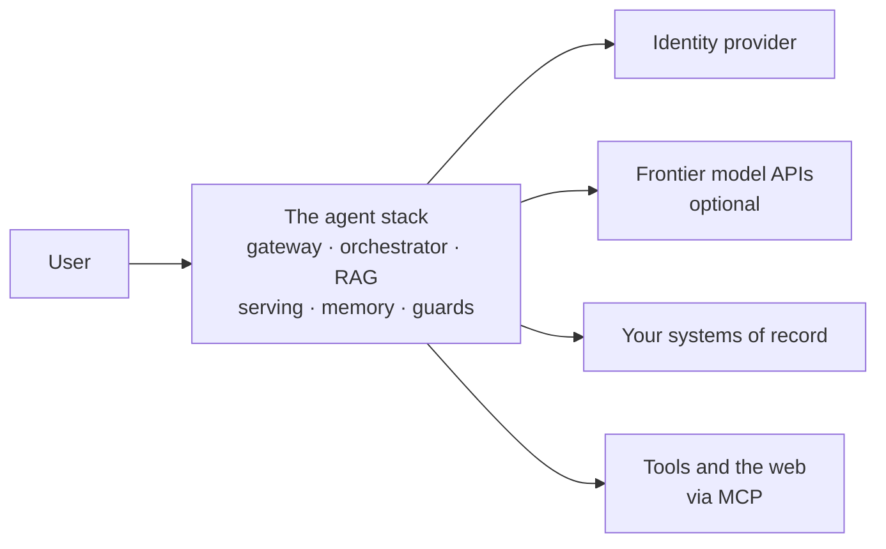

<div align="center">

# The Open-Weight Agent Stack

**A performance-first build manual for agentic AI on open-weight models.**
Hardware and serving, retrieval, memory, identity, security, and operations. 27 sections, 18 reusable diagrams, and a primary source behind every volatile claim.

[](https://github.com/mlvpatel/open-weight-agent-stack/actions/workflows/validate.yml)
[](LICENSE)
[](CONTRIBUTING.md)

**[Read the manual](MANUAL.md)** · **[Live site](https://mlvpatel.github.io/open-weight-agent-stack/)** · **[Architecture in C4](docs/ARCHITECTURE.md)** · **[Sources](MANUAL.md#27-sources-and-verification)**


</div>

## What this is

The complete blueprint for building agentic AI on open-weight models: choosing hardware and serving it fast, grounding answers in your own data, guarding every input, and operating the loop in production. Latency and throughput are the ruling metrics, because an agent loop multiplies every millisecond it spends. Every volatile claim links to its primary source, and CI re-checks all of them continuously.



The full four-level breakdown lives in [docs/ARCHITECTURE.md](docs/ARCHITECTURE.md).

## Start where your question is

| You want to know | Go to |
|---|---|
| What can my machine actually run? | [Section 2](MANUAL.md#2-what-can-you-actually-run) |
| The whole system on one diagram | [Section 5](MANUAL.md#5-master-architecture) |
| Which model for which task | [Section 22](MANUAL.md#22-task-to-model-routing) |
| Security, mapped to OWASP's ten agentic risks | [Section 19](MANUAL.md#19-threat-model) |
| Databases, queues, and state | [Section 16](MANUAL.md#16-databases-and-state) |
| Why it broke, first hour | [Section 26.1](MANUAL.md#261-when-it-breaks-the-first-hour-table) |
| Every claim's primary source | [Section 27](MANUAL.md#27-sources-and-verification) |

## Go one layer deeper

Every layer of the stack has a companion file with decision guidance, wiring notes, and a link for every tool named: **[docs/layers/](docs/layers/)**.

| | | | |
|---|---|---|---|
| [0 · Identity](docs/layers/00-identity-and-access.md) | [1 · Clients](docs/layers/01-clients.md) | [2 · Frontend](docs/layers/02-frontend-and-edge.md) | [3 · Orchestrator](docs/layers/03-orchestrator.md) |
| [4 · Knowledge decision](docs/layers/04-knowledge-decision.md) | [5 · RAG pipeline](docs/layers/05-rag-pipeline.md) | [6 · Model layer](docs/layers/06-model-layer.md) | [7 · Tools via MCP](docs/layers/07-tools-via-mcp.md) |
| [8 · Code agent](docs/layers/08-code-agent.md) | [9 · Memory and cache](docs/layers/09-memory-and-cache.md) | [10 · Guardrails and evals](docs/layers/10-guardrails-and-evals.md) | [11 · Observability](docs/layers/11-observability.md) |
| [12 · Deployment](docs/layers/12-deployment.md) | | | |

## Repository map

```
MANUAL.md            The manual. Single source of truth; all diagrams render on GitHub.
docs/ARCHITECTURE.md The system in C4: context, containers, components, code.
site/                The manual as a designed single-page site (GitHub Pages).
docs/layers/         Thirteen per-layer deep dives with tool links and wiring notes.
docs/MODELS.md       Twenty open-weight families, licence postures, org links.
diagrams/src/        All 18 diagrams as standalone .mmd files, reusable anywhere.
docs/VERIFICATION.md What automated checks do and do not prove.
diagrams/svg/        The same diagrams rendered to SVG.
scripts/             Regenerate diagrams from the manual; render themed SVGs.
.github/             CI: every diagram must compile, every link must resolve.
```

## Quickstart

```bash
git clone https://github.com/mlvpatel/open-weight-agent-stack.git
```

Read [MANUAL.md](MANUAL.md) top to bottom, or jump by the table above. To reuse a diagram, take any file from [`diagrams/src/`](diagrams/src/); they are standard Mermaid and render in GitHub, GitLab, Obsidian, and VS Code. Pre-rendered SVGs are attached to every CI run as the `diagrams-svg` artifact. If you edit a diagram in the manual, regenerate the standalone files:

```bash
npm ci
python3 scripts/extract_diagrams.py && bash scripts/render_diagrams.sh
```

## How this repo stays honest

- **One rule**: every factual claim carries its basis. Derivable arithmetic, an attributed primary source, or an explicit `indicative` marker for field heuristics nobody publishes.
- **CI checks what it can**: on every push and weekly, [`validate.yml`](.github/workflows/validate.yml) compiles every diagram and confirms every external link still resolves. It cannot judge whether a source supports the claim it is cited for. [What CI does and does not verify](docs/VERIFICATION.md).
- **Corrections are the most valued contribution.** Quote the current text, give the fix, cite a primary source. See [CONTRIBUTING.md](CONTRIBUTING.md).

## Licence and citation

[CC BY 4.0](LICENSE): use it, adapt it, teach from it, with attribution. Cite via the repository sidebar or [CITATION.cff](CITATION.cff).
