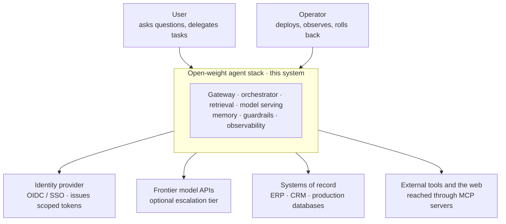
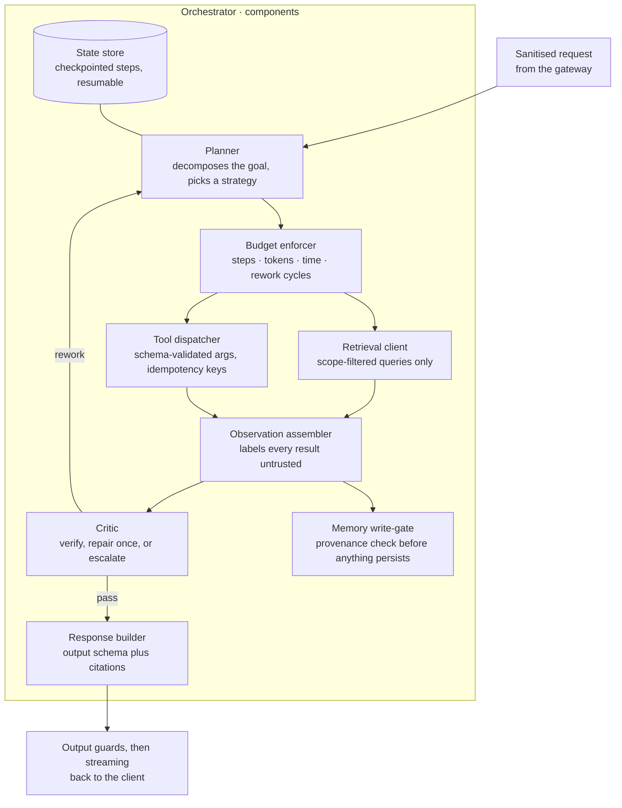

# Architecture, in C4

This document explains the open-weight agent stack through the four C4 levels: context, containers, components, code. Each level answers one question and stops where the next decision lives. The method itself is covered in [MANUAL.md, section 4](../MANUAL.md#4-the-design-method-hld-lld-and-the-rules).

## Level 1: system context

Who uses the system, and which external systems it touches. Everything inside the box is yours to build and operate; everything outside is integrated, never owned.

Two boundaries matter at this level. Identity enters from outside: the stack consumes tokens, it never stores credentials ([section 18](../MANUAL.md#18-identity-delegation-and-authority)). And systems of record stay outside: the agent reads through scoped connectors and writes through gated tools, which keeps what was never inside out of reach of injected instructions ([section 11](../MANUAL.md#11-trust-boundaries)).

## Level 2: containers

The deployable units and what runs between them. This is the manual's master architecture figure ([section 5](../MANUAL.md#5-master-architecture)); the same diagram ships as [`diagrams/src/master-architecture.mmd`](../diagrams/src/master-architecture.mmd).

```mermaid
flowchart TB
    subgraph L1["1 · Clients"]
        direction LR
        C1["Web browser"]
        C2["Mobile / PWA"]
        C3["CLI and SDK"]
        C4["Automation<br/>cron · webhooks · CI"]
    end

    subgraph L2["2 · Frontend and Edge"]
        direction LR
        F1["Next.js App Router<br/>streaming chat UI · SSE"]
        F2["Streamlit / Gradio<br/>internal tools · demos"]
    end

    GW["Gateway<br/>authn · rate limit · quota"]
    GI["10a · Input guard<br/>PII redaction · injection scan"]

    subgraph L3["3 · Agent Orchestrator · LangGraph or CrewAI"]
        direction TB
        PLAN["Planner<br/>decompose · pick strategy"]
        K4{"4 · Need external<br/>knowledge?"}
        ROUTE{"Router<br/>tool · code · generate"}
        STATE["Observe and update state<br/>checkpointed"]
        CRITIC["Critic and reflection<br/>verify · repair · escalate"]
    end

    subgraph L5["5 · RAG Pipeline"]
        direction TB
        R1["Ingest and chunk<br/>Docling"]
        R2["Embed<br/>BGE-M3"]
        R3["Hybrid search<br/>dense plus BM25"]
        R4["Rerank<br/>BGE-Reranker-v2-m3"]
        R5["Assemble context<br/>dedupe · budget · cite"]
    end

    subgraph L7["7 · Tool Use via MCP"]
        direction TB
        T0["MCP client"]
        T1["GitHub · Slack · web search"]
        T2["Databases · filesystem"]
    end

    subgraph L8["8 · Code Agent"]
        direction TB
        A0["Cline · Kilo Code · OpenHands<br/>Claude Code · Goose · Cursor"]
        A1["Sandbox<br/>container · no host mounts"]
    end

    subgraph L6["6 · LLM Layer"]
        direction TB
        M0["LLM gateway<br/>self-host serving or API endpoint"]
        M1["Fast tier · GLM-4.5-Air · Qwen 3.5 9B<br/>self-hosted · structured output"]
        M2["General · Kimi K3<br/>API, too large to self-host"]
        M3["Specialist · DeepSeek V4 Pro · GLM-5.2<br/>code and terminal"]
    end

    GO["10b · Output guard<br/>schema · toxicity · citations"]

    subgraph L9["9 · Memory, Data and Cache"]
        direction LR
        D1["Working state<br/>LangGraph store"]
        D2["Semantic cache<br/>Redis · keyed by query PLUS scope"]
        D3["Long-term memory<br/>vectors plus SQL"]
        D4B["Analytics<br/>DuckDB · Supabase"]
    end

    subgraph L11["11 · Observability and Evals"]
        direction LR
        O1["OpenTelemetry traces<br/>PII stripped at the sink"]
        O2["Phoenix / Langfuse<br/>cost · latency · quality"]
        EV["Offline evals<br/>Ragas · Promptfoo"]
    end

    C1 --> F1
    C2 --> F1
    C3 --> GW
    C4 --> GW
    F1 --> GW
    F2 --> GW
    GW --> GI
    GI --> PLAN

    PLAN --> K4
    K4 -->|Yes| R1
    K4 -->|No| ROUTE
    R1 --> R2 --> R3 --> R4 --> R5
    R5 -->|context| ROUTE

    ROUTE -->|tool call| T0
    ROUTE -->|code task| A0
    ROUTE -->|generate| M0

    T0 --> T1
    T0 --> T2
    A0 --> A1
    M0 --> M1
    M0 --> M2
    M0 --> M3

    T0 --> STATE
    A1 --> STATE
    M0 -->|completion| CRITIC
    STATE -->|next step| PLAN
    CRITIC -->|fails| PLAN
    CRITIC -->|passes| GO
    GO --> RESP["Response with citations<br/>streamed back to the client"]

    STATE <-.-> D1
    ROUTE <-.->|check before spending tokens| D2
    PLAN -.->|redacted traces| O1
    RESP -.->|redacted traces and feedback| O1
    O1 --> O2
    O2 -.->|new cases| EV
    EV -.->|prompt, model and index changes| PLAN

    classDef client fill:#e8f0fe,stroke:#0071e3,color:#1d1d1f
    classDef fe fill:#ffeeda,stroke:#bf4800,color:#5c2e00
    classDef orch fill:#dff3e6,stroke:#248a3d,color:#0f3d23
    classDef rag fill:#dff3e6,stroke:#248a3d,color:#0f3d23
    classDef llm fill:#ffe4e2,stroke:#e30000,color:#8f0000
    classDef tool fill:#e8f0fe,stroke:#0071e3,color:#003a70
    classDef mem fill:#efe3f9,stroke:#8944ab,color:#3f2c52
    classDef guard fill:#ffeeda,stroke:#d97706,color:#78350f
    classDef obs fill:#fbfbfd,stroke:#6e6e73,color:#1d1d1f
    classDef decision fill:#fff3c2,stroke:#997404,color:#5c2e00

    class C1,C2,C3,C4 client
    class F1,F2,GW,RESP fe
    class PLAN,STATE,CRITIC orch
    class K4,ROUTE decision
    class R1,R2,R3,R4,R5 rag
    class M0,M1,M2,M3 llm
    class T0,T1,T2,A0,A1 tool
    class D1,D2,D3,D4B mem
    class GI,GO guard
    class O1,O2,EV obs
```

| Container | Job | Options, ranked in the manual |
|---|---|---|
| Frontend and edge | Capture input, stream output | Next.js · SvelteKit · Streamlit · Gradio · Chainlit · Open WebUI |
| Gateway | Auth, rate limits, quotas, input guards | Your framework of choice; the contract matters, not the brand |
| Orchestrator | Plans, routes, loops, checkpoints | LangGraph · CrewAI · LlamaIndex Workflows · Pydantic AI · AutoGen |
| RAG pipeline | Ground answers in your corpus | Docling · BGE-M3 · Qdrant / pgvector · reranker |
| Model serving | Tokens per second | SGLang · vLLM · TensorRT-LLM · Ollama · llama.cpp · MLX |
| Tool layer | Reach external systems safely | MCP servers · OpenAPI tools · sandboxed execution |
| Memory and cache | State and speed | LangGraph store · Redis · Mem0 · Postgres |
| Guardrails and evals | Quality and safety, inline and offline | Outlines · Guardrails AI · Llama Guard · Ragas · Promptfoo |
| Observability | Trace and measure everything | Langfuse · Phoenix · OpenTelemetry · Prometheus · Grafana |

## Level 3: components

Inside the orchestrator, the container where agent behaviour lives. Derived from the control-loop and trust-boundary figures ([section 7](../MANUAL.md#7-agent-control-loop), [section 11](../MANUAL.md#11-trust-boundaries)).

The two components teams most often skip are the budget enforcer and the memory write-gate. The first turns an infinite loop into a bounded one; the second is the control for memory poisoning ([section 12](../MANUAL.md#12-memory-and-data-tiers), [section 19](../MANUAL.md#19-threat-model)).

## Level 4: code

C4 leaves level 4 to the repository, and so does this repo. The mapping from container to reading material:

| Container | Manual sections | Diagram source |
|---|---|---|
| Whole system | [5](../MANUAL.md#5-master-architecture), [6](../MANUAL.md#6-request-lifecycle) | `master-architecture.mmd` · `request-lifecycle.mmd` |
| Orchestrator | [7](../MANUAL.md#7-agent-control-loop), [9](../MANUAL.md#9-model-routing), [10](../MANUAL.md#10-prompt-and-turn-contract) | `agent-control-loop.mmd` · `model-routing.mmd` · `prompt-contract.mmd` |
| RAG pipeline | [8](../MANUAL.md#8-rag-pipeline-internals), [15](../MANUAL.md#15-data-lifecycle-deletion-and-re-indexing) | `rag-pipeline.mmd` · `data-lifecycle.mmd` |
| Model serving | [2](../MANUAL.md#2-what-can-you-actually-run), [14](../MANUAL.md#14-deployment-topology), [20](../MANUAL.md#20-latency-budget) | `hardware-paths.mmd` · `deployment-topology.mmd` · `latency-budget.mmd` |
| Tools and trust | [11](../MANUAL.md#11-trust-boundaries) | `trust-boundaries.mmd` |
| Memory | [12](../MANUAL.md#12-memory-and-data-tiers), [16](../MANUAL.md#16-databases-and-state) | `memory-tiers.mmd` |
| Guards and evals | [13](../MANUAL.md#13-guardrails-evals-and-the-improvement-loop) | `guardrails-evals.mmd` |
| Operations | [17](../MANUAL.md#17-serving-budgets-and-rollback), [25](../MANUAL.md#25-versioning-and-change-control), [26](../MANUAL.md#26-build-order-and-troubleshooting) | `serving-budgets.mmd` |
| Identity and security | [18](../MANUAL.md#18-identity-delegation-and-authority), [19](../MANUAL.md#19-threat-model) | `identity-delegation.mmd` · `threat-write-paths.mmd` |
| Technology choices | [21](../MANUAL.md#21-technology-catalogue), [23](../MANUAL.md#23-platform-and-sdk-choice) | `technology-catalogue.mmd` · `platform-sdk.mmd` |
